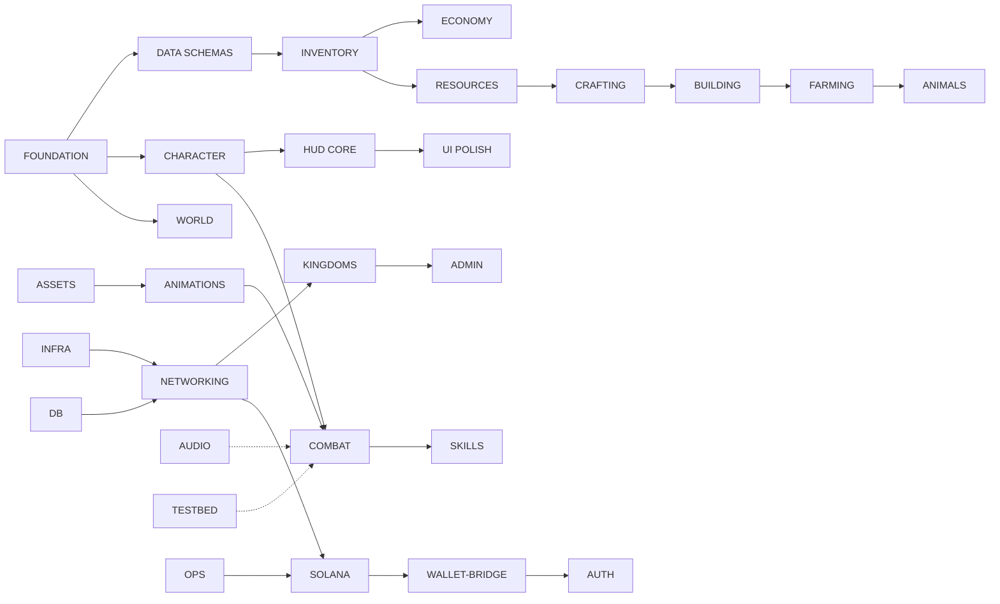

# SOVEREIGN — Implementation Tickets

Council-approved decomposition of `sovereign_prompt.md` (2,827 lines) into ~210 atomic tickets for solo development. Approved unanimously by 3 reviewers + 3 devil's advocates after one revision loop.

## How to Read This File
- **[P1]** = actionable today (Godot client only; aligns with `CLAUDE.md` Phase 1).
- **[P2]** = blocked until Phase 2 (Rust server, Solana, networking, launcher). Tags are informational only — they do not gate execution; pick whatever is unblocked.
- **`Depends on:`** uses binary edges. If the listed tickets are done, this one can start.
- **SPIKE-NNN** tickets produce a written decision memo, not code (~4 total: Anchor, Tauri, transport, Solana RPC).
- **Time estimate** is 1-4h baseline. Outliers explicitly noted.
- **Acceptance criteria** are binary checkboxes; an optional `Feel notes:` line covers movement/combat/building "feel" judgment calls.

## Critical Path (Walking-Around to Ship-It)
F-001 → F-002 → F-004 → W-001 → W-002 → W-003 → W-004 → C-001 → CO-001 → CO-006 → IN-001 → R-001 → CR-007 → B-006 → SK-001 → DB-001 → N-002 → N-008 → SO-002 → K-001 → AD-001 → UI-001 → OP-001

## Dependency Graph (Mermaid)


---

# FOUNDATION (5 tickets) [P1]

### TICKET F-001: Godot project scaffold and folder structure
**Depends on:** None
**Estimated time:** 1h
**Category:** CLIENT
**System:** Foundation

**Goal:** A Godot 4.5 project opens cleanly with the exact folder tree from the spec.

**Acceptance criteria:**
- [ ] Project opens in Godot 4.5.1 with no errors
- [ ] Folder tree matches the inline structure below exactly
- [ ] `.gitignore` excludes `.godot/`, `*.import`, `export_presets.cfg`
- [ ] `project.godot` has correct `config/name="Sovereign"` and `run/main_scene="res://scenes/main/main.tscn"`

**Inline folder tree (create all directories):**
```
sovereign/
├── project.godot
├── assets/
│   ├── models/{characters,structures,props,terrain,ui}/
│   ├── textures/{terrain,characters,ui}/
│   ├── audio/{sfx,ambient}/
│   ├── fonts/
│   └── shaders/
├── scenes/
│   ├── main/{main.tscn,main.gd}
│   ├── world/{world.tscn,world.gd,terrain.tscn,terrain.gd}
│   ├── player/{player.tscn,player.gd,player_model.tscn,player_camera.gd}
│   ├── entities/{npc.tscn,npc.gd,resource_node.tscn,resource_node.gd}
│   ├── ui/
│   │   ├── hud/{hud.tscn,hud.gd,health_bar.tscn,stamina_bar.tscn,hunger_bar.tscn,hotbar.tscn,hotbar.gd,minimap.tscn,minimap.gd}
│   │   ├── menus/{main_menu.tscn,login_screen.tscn,character_create.tscn,inventory_screen.tscn,skill_screen.tscn,build_menu.tscn,map_screen.tscn} (+.gd)
│   │   ├── chat/{chat_window.tscn,chat_window.gd}
│   │   └── trade/{trade_window.tscn,trade_window.gd,marketplace.tscn,marketplace.gd}
│   └── effects/{damage_number.tscn,damage_number.gd,hit_effect.tscn,blood_splatter.tscn}
├── scripts/
│   ├── autoload/{game_manager.gd,network_manager.gd,input_manager.gd,audio_manager.gd,config.gd}
│   ├── systems/
│   │   ├── combat/{combat_state_machine.gd,combat_states.gd,damage_calculator.gd,hit_zone_system.gd,injury_system.gd}
│   │   ├── inventory/{inventory.gd,item_database.gd,equipment_manager.gd}
│   │   ├── crafting/{crafting_system.gd,recipe_database.gd}
│   │   ├── building/{building_system.gd,blueprint_placer.gd,claim_system.gd,structure_database.gd}
│   │   ├── farming/{farming_system.gd,crop_database.gd,soil_system.gd}
│   │   ├── skills/{skill_system.gd,skill_database.gd}
│   │   ├── economy/{trade_system.gd,marketplace_system.gd}
│   │   ├── kingdom/{kingdom_system.gd,war_system.gd,diplomacy_system.gd}
│   │   └── world/{day_night_cycle.gd,weather_system.gd,season_system.gd,zone_manager.gd}
│   ├── components/{health_component.gd,stamina_component.gd,hunger_component.gd,movement_component.gd,interaction_component.gd}
│   └── data/{item_defs.gd,recipe_defs.gd,structure_defs.gd,skill_defs.gd,weapon_defs.gd}
└── addons/
```

**Files to create/modify:**
- `project.godot` — root project config
- `.gitignore` — ignore Godot cache and exports
- All directories under `assets/`, `scenes/`, `scripts/` per spec layout

**Key implementation notes:**
- Use `forward_plus` renderer per spec
- Empty `main.tscn` placeholder is fine for this ticket; F-002 wires content

---

### TICKET F-002: Autoload singletons (GameManager, InputManager, AudioManager, Config)
**Depends on:** F-001
**Estimated time:** 2h
**Category:** CLIENT
**System:** Foundation

**Goal:** Five autoload singletons registered and accessible globally.

**Acceptance criteria:**
- [ ] `GameManager`, `NetworkManager`, `InputManager`, `AudioManager`, `Config` all autoloaded per spec §1.2
- [ ] `GameManager.current_state` enum (MENU/PLAYING/PAUSED/DEAD/LOADING) functions
- [ ] `GameManager.game_time` and `game_day` advance via `_process` (use 24/7200 game-hours per real-second)
- [ ] `signal state_changed`, `time_updated`, `season_changed` defined and emit
- [ ] `GameManager.is_night()` returns true for game_time < 6.0 or > 20.0

**Files to create/modify:**
- `scripts/autoload/game_manager.gd` — global state singleton
- `scripts/autoload/network_manager.gd` — STUB (filled by F-005)
- `scripts/autoload/input_manager.gd` — input remap registry
- `scripts/autoload/audio_manager.gd` — audio bus singleton (stub)
- `scripts/autoload/config.gd` — game constants (filled by F-004)

**Key implementation notes:**
- Copy `_update_game_time` formula verbatim from spec §1.6: `game_time += delta * (24.0 / 7200.0)`
- Day rolls over at game_time >= 24.0; increment game_day

---

### TICKET F-003: Input map configuration
**Depends on:** F-001
**Estimated time:** 1h
**Category:** CLIENT
**System:** Foundation

**Goal:** All input actions from spec §1.2 bound and reachable via `Input.is_action_pressed()`.

**Acceptance criteria:**
- [ ] All 20 actions registered: move_click, attack, block, interact, inventory, build_menu, map, character_screen, hotbar_1..10, sprint, dodge, chat_enter, zone_travel, admin_console
- [ ] Mouse buttons and keys match spec §1.2 [input] block exactly
- [ ] Input rebinding API stubbed in `InputManager` (full UI in UI-004)

**Files to create/modify:**
- `project.godot` — `[input]` section
- `scripts/autoload/input_manager.gd` — load/save remap stubs

**Key implementation notes:**
- `move_click` and `attack` deliberately share LMB; player.gd disambiguates by target

---

### TICKET F-004: Config GameConstants singleton
**Depends on:** F-002
**Estimated time:** 1h
**Category:** CLIENT
**System:** Foundation

**Goal:** All gameplay constants centralized in `Config` autoload, readable from any system.

**Acceptance criteria:**
- [ ] Camera: `CAMERA_ANGLE_X=-45.0`, `CAMERA_ANGLE_Y=45.0`, `CAMERA_ZOOM_MIN=5.0`, `CAMERA_ZOOM_MAX=25.0`, `CAMERA_ZOOM_DEFAULT=12.0`, `CAMERA_FOLLOW_SPEED=8.0`
- [ ] Movement: `WALK_SPEED=5.0`, `SPRINT_SPEED=8.0`, `SPRINT_STAMINA_COST=10.0`, `ROAD_SPEED_BONUS=0.25`, `PATH_ARRIVE_THRESHOLD=0.3`
- [ ] Server: `TICK_RATE=20`, `TICK_DELTA=0.05`
- [ ] Lamports: `LAMPORTS_PER_SOL=1_000_000_000`
- [ ] Hunger: `HUNGER_RATE_BASE=1.0/60.0` (per second)

**Files to create/modify:**
- `scripts/autoload/config.gd` — flat `const` dump

**Key implementation notes:**
- Constants only; no runtime state. Hot-reloadable balance values go in DS-008.

---

### TICKET F-005: MockNetworkManager for Phase 1 single-player testability
**Depends on:** F-002
**Estimated time:** 2h
**Category:** CLIENT
**System:** Foundation

**Goal:** `NetworkManager` autoload exposes the full P2 API surface but routes everything to local mocks in P1, so combat/inventory/building tickets are testable without a server.

**Acceptance criteria:**
- [ ] All `send_*` methods exist with the same signatures the real impl will have
- [ ] `is_local_mode = true` flag triggers immediate local execution paths
- [ ] All client→server message types from spec Part 18 declared as constants (CLICK_MOVE, ATTACK_TARGET, BLOCK_START, BLOCK_END, DODGE, KICK, INTERACT, BUILD_PLACE, BUILD_CONTRIBUTE, TRADE_OFFER, MARKETPLACE_LIST, MARKETPLACE_BUY, CHAT, CRAFT, EQUIP, USE_ITEM, GATHER, REVIVE, EXECUTE, ZONE_TRAVEL)
- [ ] Replacing this file with a real ENet-backed version (N-006) requires zero call-site changes
- [ ] **"Log-only" defined**: each `send_*` returns `{ok: true, msg_id: <uuid>, mock: true}` and prints `[NETMOCK] <message_type> <payload_summary>` via `print_rich`. The real N-006 returns `{ok: bool, msg_id: <server_assigned>, mock: false}` with the same shape so callers don't branch.

**Files to create/modify:**
- `scripts/autoload/network_manager.gd` — mock-mode implementation

**Key implementation notes:**
- This is the seam Devil #3 flagged. Combat/inventory in P1 call `NetworkManager.send_attack(...)` which executes locally; same call site works once N-006 lands.

---

# DATA SCHEMAS (8 tickets) [P1]

### TICKET DS-001: Item resource schema
**Depends on:** F-004
**Estimated time:** 1h
**Category:** DATABASE
**System:** Data

**Goal:** Define the dictionary shape every item type must conform to, used by ItemDatabase (IN-003).

**Acceptance criteria:**
- [ ] `item_defs.gd` exposes `const ITEM_SCHEMA` documenting required keys
- [ ] Required keys: `display_name`, `weight`, `stackable`, `slot`, `category`
- [ ] Optional keys: `durability`, `spoil_hours`, `damage`, `armor_resistances`, `tool_type`
- [ ] Schema validator function `validate_item_def(d) -> bool` rejects malformed entries
- [ ] Comment in file maps each owner_type from spec Part 17 (`character`/`structure`/`ground`/`shop`/`vehicle`)

**Files to create/modify:**
- `scripts/data/item_defs.gd` — schema definition + validator

**Key implementation notes:** All weights in kg; weights of 0 = abstract items (currency, etc.).

---

### TICKET DS-002: Recipe schema
**Depends on:** DS-001
**Estimated time:** 1h
**Category:** DATABASE
**System:** Data

**Goal:** Define recipe dictionary shape used by RecipeDatabase (CR-001).

**Acceptance criteria:**
- [ ] `recipe_defs.gd` exposes `RECIPE_SCHEMA`
- [ ] Required: `id`, `output`, `output_quantity`, `materials[]` (each `{item_type, quantity}`), `station`, `skill`, `skill_req`, `craft_time`
- [ ] `station` enum: `inventory`, `workbench`, `forge`, `campfire`, `loom`, `tannery`, `alchemy_table`
- [ ] Validator rejects recipes referencing unknown item types (calls DS-001 validator)

**Files to create/modify:**
- `scripts/data/recipe_defs.gd`

---

### TICKET DS-003: Structure schema
**Depends on:** DS-001
**Estimated time:** 1h
**Category:** DATABASE
**System:** Data

**Goal:** Define structure dictionary shape used by StructureDatabase (B-001).

**Acceptance criteria:**
- [ ] `structure_defs.gd` exposes `STRUCTURE_SCHEMA`
- [ ] Required: `display_name`, `size_x/y/z`, `max_health`, `materials[]`, `skill_req`, `decay_rate`, `tier_unlock`
- [ ] Optional: `floor_support` (bool — required for upper floors), `lockable`, `interaction_type`
- [ ] Validator function

**Files to create/modify:**
- `scripts/data/structure_defs.gd`

---

### TICKET DS-004: Skill definition schema with XP curve
**Depends on:** F-004
**Estimated time:** 1h
**Category:** DATABASE
**System:** Data

**Goal:** Centralize skill metadata + XP math.

**Acceptance criteria:**
- [ ] `skill_defs.gd` declares all 22 skills (matches spec §6.2 SKILLS dict exactly)
- [ ] `xp_for_level(n)` returns cumulative XP per spec formula `floor(n^2*100 + n*50)`
- [ ] `level_from_xp(xp)` reverse lookup
- [ ] Constants: `TOTAL_SKILL_CAP=500`, `MAX_SKILL_LEVEL=100`, `RESPEC_COOLDOWN_DAYS=7`
- [ ] Each skill entry has `category` and `display_name`

**Files to create/modify:**
- `scripts/data/skill_defs.gd`

---

### TICKET DS-005: Weapon and armor schemas with full data
**Depends on:** DS-001
**Estimated time:** 2h
**Category:** DATABASE
**System:** Data

**Goal:** All 9 weapons and 4 armor types with exact spec values.

**Acceptance criteria:**
- [ ] `weapon_defs.gd` defines all 9 weapons from spec §4.5 with exact damage/speed/stamina_cost/range/durability/damage_type
- [ ] `armor_defs.gd` defines 4 types × 5 slots with resistance tables from spec §4.6 (None 0/0/0, Leather 20/10/15, Bronze 40/20/35, Iron 55/30/50)
- [ ] Speed penalties applied: Leather -5%, Bronze -15%, Iron -20%
- [ ] Heavy armor flag set on Bronze/Iron Plate (prevents swimming per spec §2.2)
- [ ] Kite shield from §4.5: block_stamina=8, bash_damage=8, durability=120

**Files to create/modify:**
- `scripts/data/weapon_defs.gd`
- `scripts/data/armor_defs.gd`

**Key implementation notes:** Copy verbatim from spec §1.3 weapon_defs.gd; do not invent values.

---

### TICKET DS-006: Crop and animal schemas
**Depends on:** DS-001
**Estimated time:** 1h
**Category:** DATABASE
**System:** Data

**Goal:** Crops and animals data-driven for FA-002 and AN-001.

**Acceptance criteria:**
- [ ] `crop_defs.gd` covers spec §7.1 categories: Grains (wheat, barley), Vegetables (cabbage, carrots, potatoes), Fruits (apples, berries), Industrial (cotton, flax, hops), Herbs
- [ ] Each crop: `growth_minutes` (berries 30-45, herbs 60-120, wheat/grains 180-240), `yield_item`, `season_modifier` (1.2 summer / 0.0 winter)
- [ ] `animal_defs.gd` covers MVP animals only: chicken, cow
- [ ] Each animal: `products[]`, `feed_rate`, `lifespan_days`, `pen_size_required`

**Files to create/modify:**
- `scripts/data/crop_defs.gd`
- `scripts/data/animal_defs.gd`

---

### TICKET DS-007: Settlement tier schema
**Depends on:** DS-003
**Estimated time:** 30min
**Category:** DATABASE
**System:** Data

**Goal:** 5-tier settlement table matches spec §10.1 exactly.

**Acceptance criteria:**
- [ ] `claim_system.gd` const `TIER_DATA` array of 5 entries
- [ ] Each tier: `name`, `radius`, `max_structures`, `min_population`, `upgrade_materials{}`
- [ ] Homestead 20m/15/1, Hamlet 40m/40/5 (50 planks 20 stone), Village 70m/100/15 (200 planks 100 stone), Town 120m/300/50, City 200m/∞/200
- [ ] Constants: `MIN_HEARTHSTONE_DISTANCE=50.0`, `RAIDABLE_STRUCTURE_THRESHOLD=20`, `NEW_ACCOUNT_HEARTHSTONE_DELAY=7200.0`

**Files to create/modify:**
- `scripts/systems/building/claim_system.gd` (constants section only; logic in B-004)

---

### TICKET DS-008: Hot-reloadable balance.toml + network message registry
**Depends on:** DS-005
**Estimated time:** 2h
**Category:** DATABASE
**System:** Data

**Goal:** External TOML for designer tunables; central message-type registry.

**Acceptance criteria:**
- [ ] `config/balance.toml` with `[combat]`, `[movement]`, `[economy]`, `[hunger]` sections
- [ ] `Config` autoload watches the file via `FileAccess.get_modified_time` and reloads on change
- [ ] Reload emits `Config.balance_reloaded` signal
- [ ] `scripts/data/network_messages.gd` enumerates all 22 client→server + 17 server→client message names from spec Part 18
- [ ] Each message has a `payload_keys` array for runtime validation

**Files to create/modify:**
- `config/balance.toml` — designer tunables
- `scripts/autoload/config.gd` — reload watcher
- `scripts/data/network_messages.gd` — message registry

---

# WORLD (12 tickets) [P1]

### TICKET W-001: Main scene + World scene scaffold
**Depends on:** F-002
**Estimated time:** 1h
**Category:** CLIENT
**System:** World

**Goal:** Pressing F5 loads main → world → empty scene that doesn't crash.

**Acceptance criteria:**
- [ ] `main.tscn` loads `world.tscn` as child
- [ ] `world.gd` instantiates terrain (W-002 placeholder ok), DirectionalLight, env
- [ ] `WorldEnvironment` with default sky
- [ ] No errors in console at runtime

**Files to create/modify:**
- `scenes/main/main.tscn`, `scenes/main/main.gd`
- `scenes/world/world.tscn`, `scenes/world/world.gd`

---

### TICKET W-002: Flat terrain mesh with NavigationRegion3D
**Depends on:** W-001
**Estimated time:** 2h
**Category:** CLIENT
**System:** World

**Goal:** A walkable 1500m × 1500m flat plane with baked navmesh.

**Acceptance criteria:**
- [ ] `terrain.gd` generates `PlaneMesh` size 1500×1500 (3×3 zones × 500m), 100×100 subdivisions
- [ ] Placeholder green StandardMaterial3D albedo (0.35, 0.55, 0.25)
- [ ] `NavigationRegion3D` with `agent_radius=0.4`, `agent_height=1.8`, baked
- [ ] Constants `ZONE_SIZE=500.0`, `WORLD_ZONES=3`

**Files to create/modify:**
- `scenes/world/terrain.tscn`, `scenes/world/terrain.gd`

---

### TICKET W-003: Isometric orthographic camera with zoom
**Depends on:** F-004
**Estimated time:** 2h
**Category:** CLIENT
**System:** World

**Goal:** Locked isometric camera with scroll-zoom that follows a target.

**Acceptance criteria:**
- [ ] `Camera3D` projection ORTHOGONAL, rotation_degrees `(-45, 45, 0)`
- [ ] `size = current_zoom`, clamped to [CAMERA_ZOOM_MIN, CAMERA_ZOOM_MAX]
- [ ] Mouse wheel adjusts zoom by `CAMERA_ZOOM_SPEED`
- [ ] `_process` lerps `global_position` to `target.global_position + offset` at `CAMERA_FOLLOW_SPEED`
- [ ] `screen_to_ground(Vector2)` returns the y=0 intersection of the screen-space ray

**Files to create/modify:**
- `scenes/player/player_camera.gd`

**Key implementation notes:** Camera offset uses spec §1.3 trig: `Vector3(d*cos(ax)*sin(ay), d*sin(-ax), d*cos(ax)*cos(ay))` with `d=20`.

---

### TICKET W-004: Click-to-move with NavigationAgent3D
**Depends on:** W-002, W-003, F-005
**Estimated time:** 3h
**Category:** CLIENT
**System:** World

**Goal:** Left-click on ground → character pathfinds and walks there.

**Acceptance criteria:**
- [ ] `player.gd` extends `CharacterBody3D` with `NavigationAgent3D` child
- [ ] Left-click captured in `_unhandled_input`; ground hit via `camera.screen_to_ground(event.position)`
- [ ] `nav_agent.target_position` set; `_physics_process` walks along path at WALK_SPEED
- [ ] Model rotates to face movement direction
- [ ] `nav_agent.is_navigation_finished()` stops movement
- [ ] `is_moving` flag exposed for downstream systems

**Feel notes:** Movement should feel responsive — pathfind delay <100ms.

**Files to create/modify:**
- `scenes/player/player.tscn`, `scenes/player/player.gd`
- `scenes/player/player_model.tscn` — placeholder colored capsule

---

### TICKET W-005: Sprint with stamina drain
**Depends on:** W-004, C-003
**Estimated time:** 1h
**Category:** CLIENT
**System:** World

**Goal:** Holding Shift while moving sprints faster, drains stamina.

**Acceptance criteria:**
- [ ] `Input.is_action_pressed("sprint")` triggers SPRINT_SPEED while moving
- [ ] Stamina drains at SPRINT_STAMINA_COST/sec
- [ ] Stamina <= 0 force-stops sprint, returns to WALK_SPEED
- [ ] Stamina regen 5 SP/sec only when not sprinting/attacking

---

### TICKET W-006: Day/night cycle with DirectionalLight modulation
**Depends on:** W-001, F-002
**Estimated time:** 2h
**Category:** CLIENT
**System:** World

**Goal:** Sun rotates over 2 real hours = 24 game hours; visibility drops at night.

**Acceptance criteria:**
- [ ] `DirectionalLight3D` rotation drives off `GameManager.game_time`
- [ ] Color shifts: noon = white, dusk = orange, night = deep blue
- [ ] Energy: 1.0 day → 0.05 night
- [ ] `WorldEnvironment` ambient_light_energy follows similar curve
- [ ] At night (game_time <6 or >20), unlit player should be barely visible at >5m

**Feel notes:** Night should feel oppressive — torch (W-007) is the fix.

**Files to create/modify:**
- `scripts/systems/world/day_night_cycle.gd`

---

### TICKET W-007: Torch system (handheld + placed)
**Depends on:** W-006, IN-004
**Estimated time:** 3h
**Category:** CLIENT
**System:** World

**Goal:** Equipping a torch in off-hand emits light; placed torches illuminate fixed area.

**Acceptance criteria:**
- [ ] `torch` item type lives in off_hand slot (mutual-exclusive with shield per spec §2.4)
- [ ] Equipped torch spawns OmniLight3D as player child
- [ ] Light radius ~8m, warm orange color
- [ ] Placed torch structure (B-002) emits same light, visible from 50m+
- [ ] Torch consumes durability over time (5min lifespan)

**Feel notes:** Carrying a torch at night should feel like a tactical liability (visible) and benefit (vision).

---

### TICKET W-008: Season state machine (summer/winter only)
**Depends on:** F-002
**Estimated time:** 2h
**Category:** CLIENT
**System:** World

**Goal:** Season alternates every real week; gameplay modifiers applied.

**Acceptance criteria:**
- [ ] `SeasonSystem` autoload-style node tracks current season (0=summer, 1=winter)
- [ ] `GameManager.game_day` advances; season flips after 7 real days (84 game days at 12 cycles/day)
- [ ] Summer: `hunger_rate *= 0.5`, crop yield × 1.2
- [ ] Winter: `hunger_rate *= 1.5`, move_speed × 0.85, crop yield × 0.0
- [ ] Visual: terrain tint shifts (winter = whitened albedo)
- [ ] `season_changed` signal fires

**Files to create/modify:**
- `scripts/systems/world/season_system.gd`

---

### TICKET W-009: Weather state machine (rain/clear)
**Depends on:** W-001
**Estimated time:** 2h
**Category:** CLIENT
**System:** World

**Goal:** Random weather transitions; rain reduces visibility and waters crops.

**Acceptance criteria:**
- [ ] Weather flips every 10-30 game minutes randomly
- [ ] Rain particle effect spawns over player
- [ ] Rain reduces fog distance (visibility) by 30%
- [ ] Rain triggers `crop.water()` on all FarmPlot entities (FA-005 hook)
- [ ] `weather_changed` signal

**Files to create/modify:**
- `scripts/systems/world/weather_system.gd`
- `scenes/effects/rain.tscn`

---

### TICKET W-010: Zone boundary detection + travel prompt UI
**Depends on:** W-002
**Estimated time:** 2h
**Category:** CLIENT
**System:** World

**Goal:** Approaching a zone edge shows "Press E to travel to [Zone]" prompt.

**Acceptance criteria:**
- [ ] `ZoneManager` autoload computes player's zone from world position (zone_id = floor((x+750)/500) + floor((z+750)/500)*3)
- [ ] When player within 10m of boundary, UI label appears
- [ ] Pressing `zone_travel` action triggers W-011

**Files to create/modify:**
- `scripts/systems/world/zone_manager.gd`
- `scenes/ui/hud/zone_prompt.tscn`

---

### TICKET W-011: Zone transition (fade + position remap)
**Depends on:** W-010
**Estimated time:** 3h
**Category:** CLIENT
**System:** World

**Goal:** Smooth 2-3 sec fade to black, respawn player at corresponding edge of new zone.

**Acceptance criteria:**
- [ ] ColorRect fade overlay animates 0→1→0 over 2.5s
- [ ] Player teleports to `(target_zone_center + edge_offset)` matching the boundary crossed
- [ ] During fade, input is locked
- [ ] Server-side path stub for P2 (calls `NetworkManager.send_zone_travel`)

---

### TICKET W-012: Roads + speed bonus
**Depends on:** W-002, B-002
**Estimated time:** 2h
**Category:** CLIENT
**System:** World

**Goal:** Walking on Road structures grants +25% speed.

**Acceptance criteria:**
- [ ] Road structure type with Area3D overlap detection
- [ ] On overlap, modify movement speed × `Config.ROAD_SPEED_BONUS` (1.25)
- [ ] Stacks correctly with sprint
- [ ] Visible terrain swap where road placed (texture or mesh decal)

---

### TICKET W-013: Water collision + swimming + heavy-armor block
**Depends on:** W-002, IN-004
**Estimated time:** 3h
**Category:** CLIENT
**System:** World

**Goal:** Water blocks heavy-armor players; light/cloth can swim slowly.

**Acceptance criteria:**
- [ ] Water Area3D nodes embedded in terrain (rivers/lakes/coast)
- [ ] On overlap, query equipped armor: if any piece has `heavy=true` (Bronze Plate or Iron Plate), reject movement into water
- [ ] Light/cloth players: speed × 0.5 in water, stamina drains 2× normal
- [ ] At stamina 0 in water → drowning damage (1 HP/sec)
- [ ] Visual swim animation triggers (depends on AR-002 placeholder)

---

### TICKET W-014: Bridges (Carpentry + Masonry recipe + structure)
**Depends on:** W-013, CR-005, B-008
**Estimated time:** 3h
**Category:** CLIENT
**System:** World

**Goal:** Player-built bridges span water, allow heavy-armor crossing.

**Acceptance criteria:**
- [ ] Bridge structure type (large multi-segment plank+stone span)
- [ ] Recipe: Carpentry 50 AND Masonry 50, 20 planks + 10 stone per segment
- [ ] Placed Bridge structure removes water block in its overlap area
- [ ] Spec §2.2: "Bridges player-built ONLY"

---

# CHARACTER (10 tickets) [P1]

### TICKET C-001: Player scene scaffold (CharacterBody3D + placeholder model)
**Depends on:** W-004
**Estimated time:** 1h
**Category:** CLIENT
**System:** Character

**Goal:** Player scene exists with collision capsule, placeholder model, NavigationAgent3D, child PlayerCamera.

**Acceptance criteria:**
- [ ] CharacterBody3D root with CapsuleShape3D collider (0.4 radius, 1.8 height)
- [ ] PlayerModel child with placeholder colored capsule mesh
- [ ] NavigationAgent3D configured per W-004
- [ ] PlayerCamera (W-003) attached, target = self
- [ ] Spawned in main scene at `(0, 1, 0)`

---

### TICKET C-002: HealthComponent
**Depends on:** F-002
**Estimated time:** 1h
**Category:** CLIENT
**System:** Character

**Goal:** Reusable health component with damage, heal, death signal.

**Acceptance criteria:**
- [ ] `HealthComponent` extends Node with `health`, `max_health`, `take_damage(amount)`, `heal(amount)`
- [ ] Health clamped [0, max_health]
- [ ] `signal died`, `signal damaged(amount)`, `signal healed(amount)`
- [ ] No natural regen (per spec §3.3)
- [ ] Reusable on player + NPCs

**Files to create/modify:**
- `scripts/components/health_component.gd`

---

### TICKET C-003: StaminaComponent
**Depends on:** F-002
**Estimated time:** 1h
**Category:** CLIENT
**System:** Character

**Goal:** Stamina with regen, drain, zero-lockout.

**Acceptance criteria:**
- [ ] `StaminaComponent` with `stamina`, `max_stamina=100.0`, `drain(amount)`, `regen_rate=5.0`
- [ ] `_process` regens 5 SP/sec when `is_acting=false` (set by combat/sprint)
- [ ] At `stamina <= 0`, emit `exhausted` signal
- [ ] Hunger < 20 halves regen (hook for C-004)

**Files to create/modify:**
- `scripts/components/stamina_component.gd`

---

### TICKET C-004: HungerComponent with season modifier
**Depends on:** C-003, W-008
**Estimated time:** 1h
**Category:** CLIENT
**System:** Character

**Goal:** Hunger depletes over time; below 20 halves stamina regen; at 0 deals damage.

**Acceptance criteria:**
- [ ] `HungerComponent` with `hunger=100.0`, `max_hunger=100.0`
- [ ] Depletes at 1 HG/min base; 0.5 in summer; 1.5 in winter (queries SeasonSystem)
- [ ] Hunger < 20 → set parent `StaminaComponent.regen_rate = 2.5`
- [ ] Hunger == 0 → 1 HP/10sec damage via HealthComponent

---

### TICKET C-005: Encumbrance system (weight-driven speed)
**Depends on:** C-001, IN-001
**Estimated time:** 2h
**Category:** CLIENT
**System:** Character

**Goal:** Carry weight reduces movement speed; >150% capacity locks movement.

**Acceptance criteria:**
- [ ] `_get_encumbrance_modifier()` returns 1.0 if `carry_weight <= max_carry_weight`
- [ ] Linear falloff between 100% and 150%; 0.0 at >=150%
- [ ] `current_speed *= encumbrance_mod` in `_process_movement`
- [ ] Default `max_carry_weight = 100.0`

**Key implementation notes:** Copy formula from spec §1.4 `_get_encumbrance_modifier`.

---

### TICKET C-006: Hit zone system (6 zones)
**Depends on:** None
**Estimated time:** 2h
**Category:** CLIENT
**System:** Character

**Goal:** Given attack direction + height, return zone hit.

**Acceptance criteria:**
- [ ] `HitZoneSystem.determine_hit_zone(attack_dir, attacker_pos, defender_pos, height)` returns one of `head|torso|left_arm|right_arm|left_leg|right_leg`
- [ ] `attack_height > 0.8` → head; `0.4-0.8` → torso/arms; `<0.4` → legs
- [ ] Mid-height resolution by relative angle (left_arm if relative<-30, right_arm >30, else torso)

**Files to create/modify:**
- `scripts/systems/combat/hit_zone_system.gd`

**Key implementation notes:** Copy verbatim from spec §2.3.

---

### TICKET C-007: Injury system (4 severities × 6 zones)
**Depends on:** C-006
**Estimated time:** 2h
**Category:** CLIENT
**System:** Character

**Goal:** Injuries persist, modify gameplay.

**Acceptance criteria:**
- [ ] Per-character `injuries: Dictionary` with all 6 zones, default "none"
- [ ] Damage threshold mapping: <15=none, <30=minor, <50=moderate, >=50=severe
- [ ] Broken arm: 50% melee damage cap; can't use 2H weapons
- [ ] Broken leg: limp (50% move speed)
- [ ] Severe head injury: instant down
- [ ] Injuries reset on full death+respawn (not just downed→revive)
- [ ] `injury_changed(zone, severity)` signal

**Files to create/modify:**
- `scripts/systems/combat/injury_system.gd`

---

### TICKET C-008: Downed state with bleedout timer
**Depends on:** C-002, C-007
**Estimated time:** 2h
**Category:** CLIENT
**System:** Character

**Goal:** HP=0 → bleedout countdown; revive or execute resolves it.

**Acceptance criteria:**
- [ ] `enter_downed(bleedout_time)` switches CombatStateMachine to DOWNED
- [ ] Bleedout time from `DamageCalculator.get_bleedout_time(injuries)`: severe torso=15s, severe head=10s, moderate torso=30s, default=60s
- [ ] Bleedout reaches 0 → DEAD
- [ ] Animation locked to downed pose
- [ ] Cannot move, attack, use items

---

### TICKET C-009: Death + corpse + loot window timers
**Depends on:** C-008, IN-009
**Estimated time:** 2h
**Category:** CLIENT
**System:** Character

**Goal:** On death drop all items at corpse, killer-exclusive 2 min, corpse despawns at 10 min.

**Acceptance criteria:**
- [ ] On DEAD state, spawn `Corpse` entity at position with full inventory
- [ ] `Corpse` records `killer_id`, `killer_only_until = now + 120s`
- [ ] `corpse_despawn_at = now + 600s`
- [ ] After killer-only window, anyone can loot
- [ ] Death marker (visible only to dead player) added to map (UI-003)
- [ ] Logout body persistence: 15 min (per spec §3.4)

---

### TICKET C-010: Respawn system with options + invulnerability
**Depends on:** C-009
**Estimated time:** 2h
**Category:** CLIENT
**System:** Character

**Goal:** After death, choose spawn point; 5 sec invuln; XP penalty.

**Acceptance criteria:**
- [ ] Respawn screen shows: bed location (if owned), nearest friendly town, kingdom spawn
- [ ] Timer: own settlement 5s, wilderness 10s, near enemy 30s
- [ ] On respawn: position randomized within 10m radius
- [ ] 5 sec `is_invulnerable=true`; can move but `try_attack` returns false
- [ ] Highest skill loses 1% XP (or scaled per death count)
- [ ] Naked respawn — inventory empty

**Files to create/modify:**
- `scenes/ui/menus/respawn_screen.tscn`, `respawn_screen.gd`

---

# COMBAT (25 tickets) [P1]

### TICKET CO-001: CombatStateMachine skeleton (7 states)
**Depends on:** C-001
**Estimated time:** 3h
**Category:** CLIENT
**System:** Combat

**Goal:** State machine with IDLE/ATTACKING/BLOCKING/STAGGERED/DODGING/DOWNED/DEAD and transition rules.

**Acceptance criteria:**
- [ ] All 7 states as enum
- [ ] `try_attack`, `try_block`, `stop_block`, `try_dodge`, `try_kick`, `apply_stagger`, `enter_downed` all functional per spec §2.1
- [ ] State timer countdown in `_process` advances ATTACKING/STAGGERED/DODGING
- [ ] `state_changed(old, new)` signal
- [ ] `can_be_hit()` returns false during DODGING (i-frames) and DEAD

**Files to create/modify:**
- `scripts/systems/combat/combat_state_machine.gd`
- `scripts/systems/combat/combat_states.gd`

**Key implementation notes:** Copy verbatim from spec §2.1.

---

### TICKET CO-002: Attack input detection (tap/click/hold = jab/normal/heavy)
**Depends on:** CO-001
**Estimated time:** 2h
**Category:** CLIENT
**System:** Combat

**Goal:** LMB classification: <0.1s = jab, 0.1-0.3s = normal, >0.3s = heavy.

**Acceptance criteria:**
- [ ] `_unhandled_input` tracks LMB press time
- [ ] On release: classify into tier 0/1/2
- [ ] Heavy attack requires player stationary; if moving, downgrade to normal
- [ ] Pass tier + direction (CO-003) to `combat_sm.try_attack`

---

### TICKET CO-003: Attack direction from mouse (8-sector screen-space)
**Depends on:** W-003
**Estimated time:** 1h
**Category:** CLIENT
**System:** Combat

**Goal:** Mouse position relative to character → 8-direction sector 0-7.

**Acceptance criteria:**
- [ ] `_get_attack_direction_from_mouse()` returns int 0-7
- [ ] 0=North, clockwise per spec §2.5
- [ ] 8 equal 45° sectors

**Key implementation notes:** Copy formula verbatim from spec §2.5.

---

### TICKET CO-004: WeaponDefs wiring into combat
**Depends on:** DS-005, CO-002
**Estimated time:** 1h
**Category:** CLIENT
**System:** Combat

**Goal:** `try_attack` reads weapon stats from equipped weapon.

**Acceptance criteria:**
- [ ] `EquipmentManager.get_main_hand()` returns equipped weapon item_type
- [ ] `WeaponDefs.WEAPONS[type]` provides damage/speed/stamina_cost/range
- [ ] Heavy attack tier multiplies state_timer by 1.4, jab by 0.6
- [ ] Stamina deducted before attack accepted

---

### TICKET CO-005: ArmorDefs wiring into damage receipt
**Depends on:** DS-005, IN-004
**Estimated time:** 1h
**Category:** CLIENT
**System:** Combat

**Goal:** Damage taken queries equipped armor for resistance.

**Acceptance criteria:**
- [ ] `EquipmentManager.get_armor_for_zone(zone)` returns armor type for that body slot
- [ ] Resistance lookup per damage_type matches spec §4.6 table
- [ ] Speed penalty stat from armor accumulates on player movement

---

### TICKET CO-006: DamageCalculator with full formula
**Depends on:** CO-004, CO-005, C-006
**Estimated time:** 2h
**Category:** CLIENT
**System:** Combat

**Goal:** Pure-function damage calc; tier × skill × zone × armor × block.

**Acceptance criteria:**
- [ ] `DamageCalculator.calculate_damage(...)` matches spec §2.2 signature exactly
- [ ] Tier multipliers: jab 0.5, normal 1.0, heavy 1.5
- [ ] Skill bonus: `damage *= 1.0 + skill * 0.003` (max +30% at 100)
- [ ] Zone: head 2.0, torso 1.0, arm 0.7, leg 0.8
- [ ] Block reduces 80% damage; shield stamina cost charged
- [ ] Returns dict `{final_damage, hit_zone, injury_type, blocked, block_stamina_cost}`

**Files to create/modify:**
- `scripts/systems/combat/damage_calculator.gd`

**Key implementation notes:** Copy verbatim from spec §2.2.

---

### TICKET CO-007: Melee attack execution
**Depends on:** CO-006, CO-001
**Estimated time:** 3h
**Category:** CLIENT
**System:** Combat

**Goal:** Attack lock animation, range check, apply damage to target.

**Acceptance criteria:**
- [ ] On try_attack accepted, animation timer = weapon speed
- [ ] At animation peak (~50%), perform sphere overlap query at attack position with weapon range
- [ ] All overlapping `take_damage_target` (CharacterBody3D with `take_damage` method) receive damage
- [ ] Friendly fire: no team check
- [ ] Damage event sent via `NetworkManager.send_attack` (P1 mock = local apply)

---

### TICKET CO-008: Ranged attack with physics projectile
**Depends on:** CO-006
**Estimated time:** 3h
**Category:** CLIENT
**System:** Combat

**Goal:** Bow/crossbow fires Arrow projectile that arcs and hits via collision.

**Acceptance criteria:**
- [ ] `Arrow` scene = RigidBody3D with mesh + collision
- [ ] Spawned at character bow position, velocity = forward × `WEAPONS[bow].projectile_speed`
- [ ] Gravity applies (RigidBody3D default)
- [ ] On collision, calls `take_damage` on body if it has the method
- [ ] Despawns 5 seconds after spawn or on collision
- [ ] Arrow type = pierce damage

**Files to create/modify:**
- `scenes/effects/arrow.tscn`, `arrow.gd`

---

### TICKET CO-009: Block mechanics (directional, stamina drain)
**Depends on:** CO-001, CO-003
**Estimated time:** 2h
**Category:** CLIENT
**System:** Combat

**Goal:** RMB+direction blocks attacks within 90° cone.

**Acceptance criteria:**
- [ ] RMB held → `combat_sm.try_block(current_facing_direction)`
- [ ] Movement speed halved while blocking
- [ ] On hit, `is_blocking_direction(incoming_dir)` checks within 1 sector (90°)
- [ ] If blocked: damage × 0.2, stamina drained
- [ ] If facing wrong way: full damage applied
- [ ] RMB released stops block

---

### TICKET CO-010: Dodge with i-frames + cooldown
**Depends on:** CO-001
**Estimated time:** 2h
**Category:** CLIENT
**System:** Combat

**Goal:** Spacebar dashes 0.3s with invulnerability, 1s cooldown, 20 SP cost.

**Acceptance criteria:**
- [ ] Constants: DODGE_DURATION=0.3, DODGE_SPEED=15.0, DODGE_STAMINA_COST=20.0, DODGE_COOLDOWN=1.0
- [ ] During DODGING, `can_be_hit()` returns false
- [ ] velocity = dodge_direction × DODGE_SPEED, applied via `move_and_slide`
- [ ] Stamina deducted on entry; cooldown timer prevents re-entry

---

### TICKET CO-011: Kick / Stagger
**Depends on:** CO-001
**Estimated time:** 2h
**Category:** CLIENT
**System:** Combat

**Goal:** Kick action breaks blocks and staggers; stamina-broken hits also stagger.

**Acceptance criteria:**
- [ ] Bound input or hotbar slot triggers `try_kick` (15 SP)
- [ ] Sphere overlap at 1.5m forward; if any target is BLOCKING, force them out + apply STAGGERED 0.5s
- [ ] Hit while ATTACKING transitions to STAGGERED
- [ ] Stamina hit while at 0 stamina → STAGGERED
- [ ] STAGGERED disables all combat actions for 0.5s

---

### TICKET CO-012: Friendly fire enforcement
**Depends on:** CO-007
**Estimated time:** 30min
**Category:** CLIENT
**System:** Combat

**Goal:** No team check on hit detection.

**Acceptance criteria:**
- [ ] Sphere overlap returns ALL CharacterBody3D in radius
- [ ] No `if attacker.team == defender.team: skip` filter
- [ ] Documented in damage_calculator.gd as design intent

---

### TICKET CO-013: Kite shield + block stamina cost
**Depends on:** CO-009, IN-004
**Estimated time:** 1h
**Category:** CLIENT
**System:** Combat

**Goal:** Equipped shield in off_hand provides reduced stamina cost on blocks.

**Acceptance criteria:**
- [ ] `kite_shield` item in DS-001
- [ ] When equipped + blocking, stamina cost per blocked hit = 8 (vs 12 without shield)
- [ ] Shield bash attack (kick variant) deals 8 damage
- [ ] Shield durability degrades 1 per blocked hit

---

### TICKET CO-014: Dummy NPC AI states
**Depends on:** CO-007, W-002
**Estimated time:** 3h
**Category:** CLIENT
**System:** Combat

**Goal:** NPC patrols, aggros on player, chases, attacks.

**Acceptance criteria:**
- [ ] `NPCEntity` per spec §2.6 with AIState enum (IDLE/PATROL/CHASE/ATTACK/FLEE)
- [ ] Patrol within `patrol_radius` of `patrol_center`
- [ ] Aggro when player within `aggro_range=10m`
- [ ] Chase if player further than `attack_range=1.5m`, else attack
- [ ] Attacks call `combat_sm.try_attack(1, 0, ...)` once per cycle
- [ ] Drops back to PATROL if player out of `aggro_range × 1.5`

**Files to create/modify:**
- `scenes/entities/npc.tscn`, `scenes/entities/npc.gd`

---

### TICKET CO-015: Damage numbers VFX
**Depends on:** CO-007
**Estimated time:** 1h
**Category:** CLIENT
**System:** Combat

**Goal:** Floating damage number on hit.

**Acceptance criteria:**
- [ ] `DamageNumber` scene with Label3D
- [ ] Spawns above target on hit
- [ ] Tweens upward + fades over 1s
- [ ] Color codes: white normal, red crit (head/heavy), gray blocked

**Files to create/modify:**
- `scenes/effects/damage_number.tscn`, `damage_number.gd`

---

### TICKET CO-016: Hit effects + blood splatter
**Depends on:** CO-007
**Estimated time:** 1h
**Category:** CLIENT
**System:** Combat

**Goal:** Visual feedback on hit.

**Acceptance criteria:**
- [ ] `HitEffect` particle burst at hit point
- [ ] `BloodSplatter` decal placed on terrain on severe damage
- [ ] Persist 30s

**Files to create/modify:**
- `scenes/effects/hit_effect.tscn`, `scenes/effects/blood_splatter.tscn`

---

### TICKET CO-017: Equipment durability degrade and break
**Depends on:** CO-007, IN-001
**Estimated time:** 1h
**Category:** CLIENT
**System:** Combat

**Goal:** Weapons/armor lose durability with use; break at 0.

**Acceptance criteria:**
- [ ] Weapon: -1 durability per attack
- [ ] Armor: -1 durability per absorbed hit
- [ ] At 0 durability, item destroyed; broadcast `item_broken`
- [ ] Cannot equip broken items

---

### TICKET CO-018: Repair system
**Depends on:** CO-017, CR-007
**Estimated time:** 2h
**Category:** CLIENT
**System:** Combat

**Goal:** Repair item at forge with materials; max durability decreases by 5%.

**Acceptance criteria:**
- [ ] Right-click damaged item in inventory at forge → "Repair" option
- [ ] Cost = 30% of new craft materials
- [ ] Each repair: `max_durability -= max(1, max_durability * 0.05)`
- [ ] Cannot repair if max_durability < 10
- [ ] Smithing skill > 50 reduces max_durability loss to 3%

---

### TICKET CO-019: Cosmetic layer (tabards, cloaks, heraldry)
**Depends on:** IN-004, CR-003
**Estimated time:** 2h
**Category:** CLIENT
**System:** Combat

**Goal:** Tailoring-crafted cosmetics overlay armor.

**Acceptance criteria:**
- [ ] `cosmetic_slot` in equipment manager (over chest armor)
- [ ] Tabard mesh attached as child of player_model on equip
- [ ] Heraldry texture configurable via player input (4 colors + 4 patterns)
- [ ] Kingdom-issued tabards lock to kingdom heraldry

---

### TICKET CO-020: Battering ram structure
**Depends on:** B-002, K-007
**Estimated time:** 4h
**Category:** CLIENT
**System:** Combat

**Goal:** 4-player pushable ram damages walls during war.

**Acceptance criteria:**
- [ ] `battering_ram` structure type, large physics body
- [ ] Push interaction: 4 players within 2m holding interact key → ram moves at 1m/s
- [ ] Collision with `wall` or `gate` structures during active war: 25 damage/hit
- [ ] Outside war state: no damage applied
- [ ] Player-built via Carpentry skill 50

---

### TICKET CO-021: Destructible walls + war-gated damage
**Depends on:** CO-020, K-006
**Estimated time:** 2h
**Category:** CLIENT
**System:** Combat

**Goal:** Walls have HP; only damageable during active war.

**Acceptance criteria:**
- [ ] Wall structures expose `take_damage(amount)`
- [ ] Damage rejected unless `WarSystem.is_active_against(attacker, owner)` true
- [ ] HP 0 → wall removed; broadcast structure_destroyed
- [ ] Visual damage tiers (cracks at 50%, holes at 25%)

---

### TICKET CO-022: Bleedout integration with combat SM
**Depends on:** C-008, CO-006
**Estimated time:** 1h
**Category:** CLIENT
**System:** Combat

**Goal:** Damage that drops HP to 0 calls `enter_downed` with calculated bleedout time.

**Acceptance criteria:**
- [ ] On HP <= 0: `combat_sm.enter_downed(DamageCalculator.get_bleedout_time(injuries))`
- [ ] If injuries map shows severe head, instant DEAD instead of DOWNED
- [ ] Animation switches to downed pose

---

### TICKET CO-023: Execution channel (3-5 sec interruptible)
**Depends on:** C-008
**Estimated time:** 2h
**Category:** CLIENT
**System:** Combat

**Goal:** Standing over downed enemy, hold interact for 3-5s to execute.

**Acceptance criteria:**
- [ ] Interact-hold near DOWNED target shows progress bar
- [ ] Channel time 3.5s default
- [ ] Channel cancels if executor takes damage or moves >0.5m
- [ ] On complete: target → DEAD, executor gains kill credit

---

### TICKET CO-024: Revive with bandages
**Depends on:** C-008, IN-001
**Estimated time:** 2h
**Category:** CLIENT
**System:** Combat

**Goal:** Ally with bandage can revive DOWNED target with 5s channel.

**Acceptance criteria:**
- [ ] Interact-hold on DOWNED ally with `bandage` item in inventory
- [ ] 5s channel; consumes 1 bandage
- [ ] On complete: target → IDLE, HP restored to 25%, injuries persist
- [ ] Cancellation conditions same as CO-023

---

### TICKET CO-025: Combat skill XP hooks
**Depends on:** CO-007, CO-008, SK-001
**Estimated time:** 1h
**Category:** CLIENT
**System:** Combat

**Goal:** Wins/hits award skill XP.

**Acceptance criteria:**
- [ ] Successful melee hit: +10 melee_weapons XP
- [ ] Successful ranged hit: +10 ranged_weapons XP
- [ ] Successful block: +5 defense XP
- [ ] Kill: +50 XP in weapon-skill used
- [ ] XP bound through `SkillSystem.add_xp(skill, amount)`

---

# INVENTORY & ITEMS (10 tickets) [P1]

### TICKET IN-001: Inventory data structure with weight + slot tracking
**Depends on:** DS-001
**Estimated time:** 2h
**Category:** CLIENT
**System:** Inventory

**Goal:** `Inventory` Node with items array, weight tracking, slot limit.

**Acceptance criteria:**
- [ ] Per spec §3.2: `items: Array[Dictionary]`, `max_weight=100.0`, `current_weight=0.0`, `max_slots=40`
- [ ] Signals: `item_added`, `item_removed`, `weight_changed`, `inventory_full`
- [ ] Hard cap at 150% weight blocks add
- [ ] Stackable items merge into existing stack

**Files to create/modify:**
- `scripts/systems/inventory/inventory.gd`

**Key implementation notes:** Copy verbatim from spec §3.2.

---

### TICKET IN-002: add_item / remove_item / has_item / get_items_of_type
**Depends on:** IN-001
**Estimated time:** 1h
**Category:** CLIENT
**System:** Inventory

**Goal:** Core inventory query and mutation API.

**Acceptance criteria:**
- [ ] `add_item(type, qty, quality)` returns bool, fires signals
- [ ] `remove_item(item_id, qty)` partial-quantity capable
- [ ] `has_item(type, qty)` aggregates across stacks
- [ ] `get_items_of_type(type)` returns array of dicts
- [ ] `_generate_id()` returns unique string

---

### TICKET IN-003: ItemDatabase singleton populated with all MVP items
**Depends on:** DS-001, DS-005
**Estimated time:** 2h
**Category:** CLIENT
**System:** Inventory

**Goal:** All MVP items defined: 9 weapons, 4 armor types × 5 slots, foods, resources, tools.

**Acceptance criteria:**
- [ ] `ItemDatabase.get_item(type)` returns dict
- [ ] All 9 weapons present (matches DS-005)
- [ ] All 20 armor pieces (4 types × 5 slots) present
- [ ] Resources: wood_log, planks, stone, iron_ore, copper_ore, fiber, flint, coal
- [ ] Tools: stone_axe, bronze_axe, iron_axe, stone_pickaxe, bronze_pickaxe, iron_pickaxe, hammer, knife
- [ ] Foods: berries, bread, meat_raw, meat_cooked, fish_raw, fish_cooked, ale, wine
- [ ] Misc: bandage, torch, rope, seed_*, bucket, kite_shield

**Files to create/modify:**
- `scripts/systems/inventory/item_database.gd`

---

### TICKET IN-004: EquipmentManager with 7 slots
**Depends on:** IN-001
**Estimated time:** 2h
**Category:** CLIENT
**System:** Inventory

**Goal:** 5 armor slots + main_hand + off_hand with equip/unequip and stat application.

**Acceptance criteria:**
- [ ] Slot enum: `head`, `chest`, `legs`, `hands`, `feet`, `main_hand`, `off_hand`
- [ ] `equip(item_id, slot)` validates item-slot compatibility
- [ ] `unequip(slot)` returns item to inventory
- [ ] `get_armor_for_zone(zone)` maps hit zones to equipped armor
- [ ] Equipping iron_plate sets `swim_blocked = true`
- [ ] Equipping torch in off_hand prevents shield equip and vice versa
- [ ] Speed penalties from armor sum and apply to player movement

**Files to create/modify:**
- `scripts/systems/inventory/equipment_manager.gd`

---

### TICKET IN-005: Equip/unequip stat application wiring
**Depends on:** IN-004
**Estimated time:** 1h
**Category:** CLIENT
**System:** Inventory

**Goal:** Stat changes propagate immediately to player on equip/unequip.

**Acceptance criteria:**
- [ ] `equipment_changed(slot, item)` signal fires
- [ ] Player listens, recomputes movement penalty + carry_weight aggregate
- [ ] HUD reflects new stats within 1 frame

---

### TICKET IN-006: Item spoilage timer
**Depends on:** IN-001
**Estimated time:** 1h
**Category:** CLIENT
**System:** Inventory

**Goal:** Foods with `spoil_at` timestamp destroy themselves when expired.

**Acceptance criteria:**
- [ ] Inventory `_process` checks each item's `spoil_at`
- [ ] On expiry, remove item + log "X spoiled"
- [ ] Spoil times: raw 2-4hr, cooked 8-12hr, preserved >48hr

---

### TICKET IN-007: Inventory UI (grid + drag-drop + tooltip)
**Depends on:** IN-002, IN-004
**Estimated time:** 3h
**Category:** CLIENT
**System:** Inventory

**Goal:** Press I to open inventory; drag items into equipment slots.

**Acceptance criteria:**
- [ ] 8×5 grid of `InventorySlot` controls
- [ ] Equipment paper-doll with 7 slot dropzones
- [ ] Drag-and-drop between inventory and equipment
- [ ] Tooltip on hover shows: name, weight, durability, quality, crafter, custom_name
- [ ] Right-click context menu: Use, Drop, Equip, Repair
- [ ] Weight bar at top of UI

**Files to create/modify:**
- `scenes/ui/menus/inventory_screen.tscn`, `inventory_screen.gd`

---

### TICKET IN-008: Hotbar (10 slots, number keys, HUD-mounted)
**Depends on:** IN-007, F-003, HC-001
**Estimated time:** 2h
**Category:** CLIENT
**System:** Inventory

**Goal:** Bottom-screen 10-slot hotbar mounted in HUD; number keys activate. (Merged with former HC-005.)

**Acceptance criteria:**
- [ ] 10 slots, drag from inventory
- [ ] Keys 1-0 trigger slot's `use_item`
- [ ] Active slot highlighted
- [ ] Visual feedback on use (cooldown swipe)
- [ ] Mounted at bottom-center of HUD CanvasLayer

**Files to create/modify:**
- `scenes/ui/hud/hotbar.tscn`, `hotbar.gd`

---

### TICKET IN-009: Item drop on death (spawn at corpse)
**Depends on:** C-009, IN-001
**Estimated time:** 1h
**Category:** CLIENT
**System:** Inventory

**Goal:** Death drops all items into the corpse entity inventory.

**Acceptance criteria:**
- [ ] `Corpse` entity has its own Inventory instance
- [ ] On death, transfer all player items + equipment to corpse
- [ ] Player inventory empty after respawn

---

### TICKET IN-010: Corpse loot UI with killer-only timer
**Depends on:** IN-009, C-009
**Estimated time:** 2h
**Category:** CLIENT
**System:** Inventory

**Goal:** Interact with corpse → loot panel; first 2 min only killer can loot.

**Acceptance criteria:**
- [ ] Loot UI = simplified inventory grid showing corpse contents
- [ ] If `now < corpse.killer_only_until`, only `killer_id` can open
- [ ] Other players see "Killer-only loot for Xs"
- [ ] Take-all button transfers all to player inventory respecting weight

---

# RESOURCES (6 tickets) [P1]

### TICKET R-001: ResourceNode base class
**Depends on:** W-002
**Estimated time:** 2h
**Category:** CLIENT
**System:** Resources

**Goal:** Base class with HP, yield, respawn timer.

**Acceptance criteria:**
- [ ] `ResourceNode` extends `StaticBody3D` per spec §3.4
- [ ] Exports: resource_type, max_health, yield_item, yield_quantity, required_tool, required_skill, required_skill_level, gather_time, respawn_time
- [ ] `gather_hit(damage)` returns yield dict
- [ ] Respawn timer ticks; node hides when depleted, shows on respawn
- [ ] Signals per spec §3.4

**Files to create/modify:**
- `scenes/entities/resource_node.tscn`, `scenes/entities/resource_node.gd`

**Key implementation notes:** Copy verbatim from spec §3.4.

---

### TICKET R-002: Resource node definitions for all MVP node types
**Depends on:** R-001
**Estimated time:** 2h
**Category:** CLIENT
**System:** Resources

**Goal:** Tree, Stone, OreCopper, OreIron, BerryBush, FlintRock, FiberPlant defined.

**Acceptance criteria:**
- [ ] Each defined as scene preset of ResourceNode with unique mesh + stats
- [ ] Tree: hp 100, yields 3 wood_log, axe required
- [ ] Stone: hp 80, yields 2 stone, pickaxe required
- [ ] OreCopper: hp 100, yields 2 copper_ore, pickaxe + Mining 1
- [ ] OreIron: hp 150, yields 2 iron_ore, pickaxe + Mining 50
- [ ] BerryBush: hp 20, yields 5 berries, hand-gatherable
- [ ] FlintRock: hp 30, yields 3 flint, hand-gatherable
- [ ] FiberPlant: hp 10, yields 2 fiber, hand-gatherable

---

### TICKET R-003: Gathering interaction with progress bar
**Depends on:** R-001, IN-002
**Estimated time:** 2h
**Category:** CLIENT
**System:** Resources

**Goal:** Walk up to node, hold E, progress bar fills, item added.

**Acceptance criteria:**
- [ ] Interact triggers `can_gather(tool, skill, level)` check
- [ ] Progress bar UI shows over node for `gather_time` seconds
- [ ] On complete, `gather_hit(damage)` called; if yield, add to inventory
- [ ] Cancellation if player moves >2m or releases E

**Files to create/modify:**
- `scripts/components/interaction_component.gd`
- `scenes/ui/hud/progress_bar.tscn`

---

### TICKET R-004: Node depletion + visual hide + respawn
**Depends on:** R-001
**Estimated time:** 1h
**Category:** CLIENT
**System:** Resources

**Goal:** Depleted node disappears for `respawn_time`, then returns.

**Acceptance criteria:**
- [ ] On `is_depleted=true`, set `visible=false` + disable collision
- [ ] After `respawn_time` (default 300s), reset health, visible=true
- [ ] `node_respawned` signal

---

### TICKET R-005: Hand-gatherable resources work without tool
**Depends on:** R-002
**Estimated time:** 30min
**Category:** CLIENT
**System:** Resources

**Goal:** Berries, flint, fiber gatherable barehanded.

**Acceptance criteria:**
- [ ] BerryBush, FlintRock, FiberPlant have `required_tool=""`
- [ ] Gathering succeeds with empty main_hand

---

### TICKET R-006: Tool-gated resources reject without correct tool
**Depends on:** R-002
**Estimated time:** 30min
**Category:** CLIENT
**System:** Resources

**Goal:** Tree without axe, stone without pickaxe, refuse gathering.

**Acceptance criteria:**
- [ ] `can_gather` returns false when wrong tool
- [ ] UI shows "Need [axe]"
- [ ] Tool durability degrades 1 per gather

---

# CRAFTING (9 tickets) [P1]

### TICKET CR-001: RecipeDatabase + recipe schema instances
**Depends on:** DS-002
**Estimated time:** 2h
**Category:** CLIENT
**System:** Crafting

**Goal:** RecipeDatabase singleton with `get_recipe(id)`.

**Acceptance criteria:**
- [ ] `RecipeDatabase.get_recipe(id)` returns dict
- [ ] `RecipeDatabase.recipes_for_station(station)` returns array
- [ ] `RecipeDatabase.recipes_for_skill(skill)` returns array

**Files to create/modify:**
- `scripts/systems/crafting/recipe_database.gd`

---

### TICKET CR-002: Recipe content — weapons
**Depends on:** CR-001, IN-003
**Estimated time:** 2h
**Category:** CLIENT
**System:** Crafting

**Goal:** Recipes for all 9 weapons + arrows + bolts.

**Acceptance criteria:**
- [ ] flint_knife: inventory station, no skill, 5 flint + 1 stick, 5s
- [ ] bronze_sword: forge, smithing 25, 3 copper_ore + 1 tin_ore + 1 stick, 30s
- [ ] iron_sword: forge, smithing 50, 4 iron_ore + 1 stick, 45s
- [ ] All spear/mace variants similar
- [ ] short_bow: workbench, fletching 25, 2 wood_log + 2 fiber, 20s
- [ ] crossbow: workbench, fletching 50, 4 planks + 2 iron_ore + 1 fiber, 60s
- [ ] arrow (output 5): workbench, fletching 1, 1 wood_log + 1 flint + 1 fiber

---

### TICKET CR-003: Recipe content — armor
**Depends on:** CR-001
**Estimated time:** 2h
**Category:** CLIENT
**System:** Crafting

**Goal:** All 20 armor pieces (4 types × 5 slots).

**Acceptance criteria:**
- [ ] Leather slots: leatherworking 25, 2-4 leather each, 30-45s
- [ ] Bronze slots: forge, smithing 25, 3-6 copper + tin, 45-60s
- [ ] Iron slots: forge, smithing 50, 4-8 iron, 60-90s
- [ ] Cloth: tailoring 1, 2-4 fiber, 15-20s
- [ ] Helmets/chests cost ~2× legs/feet

---

### TICKET CR-004: Recipe content — tools
**Depends on:** CR-001
**Estimated time:** 1h
**Category:** CLIENT
**System:** Crafting

**Goal:** Axes, pickaxes, hammer, bucket, rope.

**Acceptance criteria:**
- [ ] stone_axe: inventory, 1 flint + 1 stick + 1 fiber
- [ ] bronze_axe / iron_axe: forge, smithing 25/50
- [ ] pickaxe variants similar
- [ ] hammer (for repair): forge, smithing 25
- [ ] bucket: workbench, carpentry 25, 4 planks
- [ ] rope: inventory, 5 fiber → 1 rope

---

### TICKET CR-005: Recipe content — structures
**Depends on:** CR-001, B-001
**Estimated time:** 2h
**Category:** CLIENT
**System:** Crafting

**Goal:** Recipes for all buildable structures (returns blueprint, not item).

**Acceptance criteria:**
- [ ] wall_wood: carpentry 1, 4 planks
- [ ] wall_stone: masonry 25, 4 stone
- [ ] floor_wood: carpentry 1, 3 planks
- [ ] door_wood: carpentry 25, 3 planks
- [ ] roof: carpentry 25, 6 planks
- [ ] workbench: carpentry 1, 8 planks
- [ ] forge: masonry 25, 10 stone + 4 planks
- [ ] campfire: 4 stone + 2 wood_log
- [ ] torch_placed: 1 wood_log + 1 fiber
- [ ] hearthstone: 8 stone + 2 wood_log

---

### TICKET CR-006: Recipe content — food
**Depends on:** CR-001
**Estimated time:** 1h
**Category:** CLIENT
**System:** Crafting

**Goal:** Cooking recipes producing buff foods.

**Acceptance criteria:**
- [ ] meat_cooked: campfire, cooking 1, 1 meat_raw, 10s
- [ ] fish_cooked: campfire, cooking 1, 1 fish_raw, 10s
- [ ] bread: cooking 25, 2 wheat + 1 water, 30s, requires oven
- [ ] ale: cooking 50, 4 barley + 1 hops + 1 water, 60s, requires brewing_vat
- [ ] Each cooked food has `spoil_hours` ~10

---

### TICKET CR-007: CraftingSystem core (consume, timer, completion)
**Depends on:** CR-001, IN-002
**Estimated time:** 3h
**Category:** CLIENT
**System:** Crafting

**Goal:** `attempt_craft(recipe_id, inventory, station, skill)` runs the lifecycle.

**Acceptance criteria:**
- [ ] Validates station match, skill threshold, materials available
- [ ] Consumes materials atomically
- [ ] Starts craft timer; on completion, fires craft_completed
- [ ] Emits craft_failed with reason on any rejection

**Files to create/modify:**
- `scripts/systems/crafting/crafting_system.gd`

**Key implementation notes:** Copy verbatim from spec §3.3.

---

### TICKET CR-008: Station proximity check + failure chance + quality roll
**Depends on:** CR-007
**Estimated time:** 1h
**Category:** CLIENT
**System:** Crafting

**Goal:** Player must be within 3m of correct station; failure and quality calculated.

**Acceptance criteria:**
- [ ] Station search: nearby StaticBody3D with `station_type` matches recipe
- [ ] Failure formula: `max(0.01, 0.30 / (skill / skill_req))` per spec §3.3
- [ ] Superior quality formula: `max(0, (skill - 50) / 250)` per spec §3.3
- [ ] On failure, materials are lost (already consumed)
- [ ] On superior, item.quality = "superior" with stats × 1.2

---

### TICKET CR-009: Crafting UI (recipe list + materials + progress)
**Depends on:** CR-007, IN-007
**Estimated time:** 3h
**Category:** CLIENT
**System:** Crafting

**Goal:** Press F at station to open recipe list filtered by available materials + skill.

**Acceptance criteria:**
- [ ] Tabbed list by category (Weapons / Armor / Tools / Structures / Food)
- [ ] Recipes greyed if missing materials or skill
- [ ] Click to start craft; progress bar shows
- [ ] Crafter name auto-stamped on output
- [ ] Optional custom name input (max 32 chars)

**Files to create/modify:**
- `scenes/ui/menus/crafting_screen.tscn`, `crafting_screen.gd`

---

# BUILDING (14 tickets) [P1]

### TICKET B-001: StructureDatabase + structure_defs.gd content
**Depends on:** DS-003
**Estimated time:** 2h
**Category:** CLIENT
**System:** Building

**Goal:** All MVP structures defined with size, HP, materials.

**Acceptance criteria:**
- [ ] StructureDatabase.get_structure(type) returns dict
- [ ] All entries: hearthstone, wall_wood, wall_stone, floor_wood, door_wood, roof, workbench, forge, campfire, torch_placed, oven, brewing_vat, marketplace_stall, throne, well, irrigation_channel, farm_plot, animal_pen, road, bridge, battering_ram

**Files to create/modify:**
- `scripts/systems/building/structure_database.gd`
- `scripts/data/structure_defs.gd` (data file)

---

### TICKET B-002: Structure scene templates
**Depends on:** B-001
**Estimated time:** 3h
**Category:** CLIENT
**System:** Building

**Goal:** Each structure type has a scene with mesh, collision, interaction component.

**Acceptance criteria:**
- [ ] Each structure type loadable as PackedScene from `scenes/structures/<type>.tscn`
- [ ] Placeholder box meshes acceptable for alpha
- [ ] StaticBody3D with correct collision shape
- [ ] Interactive structures (forge, workbench, oven) expose `station_type` for CR-008

---

### TICKET B-003: Hearthstone placement (validates 2hr playtime)
**Depends on:** B-001, DS-007
**Estimated time:** 2h
**Category:** CLIENT
**System:** Building

**Goal:** Player places Hearthstone via build menu; creates Settlement.

**Acceptance criteria:**
- [ ] Build menu has Hearthstone option (only one per player)
- [ ] On placement: `can_place_hearthstone` validates playtime >= 7200s
- [ ] Validates min 50m distance from any other Hearthstone
- [ ] Creates Settlement entity with tier=0 (Homestead), radius=20m
- [ ] Visual claim boundary circle drawn on terrain

---

### TICKET B-004: ClaimSystem (radius check, max-structure-per-tier)
**Depends on:** DS-007
**Estimated time:** 2h
**Category:** CLIENT
**System:** Building

**Goal:** Validates structure placement against settlement claim and tier limits.

**Acceptance criteria:**
- [ ] `can_place_structure(pos, owner)` checks within owner's claim radius
- [ ] Rejects if structure_count >= max_structures for tier
- [ ] Rejects if pos within another player's claim
- [ ] `is_raidable` checks tier or >20 structures threshold

**Files to create/modify:**
- `scripts/systems/building/claim_system.gd`

**Key implementation notes:** Copy logic from spec §4.2.

---

### TICKET B-005: 50m hearthstone separation enforcement
**Depends on:** B-003
**Estimated time:** 30min
**Category:** CLIENT
**System:** Building

**Goal:** `can_place_hearthstone` rejects placements <50m from any other.

**Acceptance criteria:**
- [ ] Spatial query (or full settlement scan) on placement
- [ ] UI rejects with "Too close to settlement [Name]"

---

### TICKET B-006: BlueprintPlacer (ghost mesh, mouse follow, rotation)
**Depends on:** B-001, W-003
**Estimated time:** 3h
**Category:** CLIENT
**System:** Building

**Goal:** Translucent ghost follows mouse; LMB places, RMB cancels, scroll rotates.

**Acceptance criteria:**
- [ ] Ghost mesh from structure type's BoxMesh sized per def
- [ ] Material: green-translucent if valid, red-translucent if invalid
- [ ] Scroll wheel rotates by 15°
- [ ] LMB places (creates blueprint); RMB cancels

**Files to create/modify:**
- `scripts/systems/building/blueprint_placer.gd`

**Key implementation notes:** Copy verbatim from spec §4.3.

---

### TICKET B-007: Blueprint resource delivery + build progress
**Depends on:** B-006, IN-002
**Estimated time:** 2h
**Category:** CLIENT
**System:** Building

**Goal:** Interact with blueprint to deposit materials; HP fills as percent.

**Acceptance criteria:**
- [ ] Interact opens "deposit" panel listing required materials
- [ ] Player transfers items from inventory; build_progress increases
- [ ] At 100%, blueprint becomes solid structure (B-008)
- [ ] Partial demolish returns deposited materials

---

### TICKET B-008: Structure completion (ghost → solid + functionality)
**Depends on:** B-007
**Estimated time:** 1h
**Category:** CLIENT
**System:** Building

**Goal:** When build_progress hits 100%, swap blueprint for real structure scene.

**Acceptance criteria:**
- [ ] Replace blueprint Node3D with structure scene from B-002
- [ ] Apply collision, mesh, interaction component
- [ ] Settlement.structure_count incremented

---

### TICKET B-009a: Placement-time support raycast
**Depends on:** B-008
**Estimated time:** 3h
**Category:** CLIENT
**System:** Building

**Goal:** Upper-floor placements rejected if no wall/column directly below.

**Acceptance criteria:**
- [ ] On blueprint placement, if floor_level > 0, raycast straight down
- [ ] Hit must be a wall or column structure of same or larger footprint
- [ ] Ghost shows red if unsupported
- [ ] Multi-story limit: max floor_level = 2 (3 floors total)

---

### TICKET B-009b: Cascade collapse on support destruction
**Depends on:** B-009a
**Estimated time:** 4h
**Category:** SERVER
**System:** Building

**Goal:** When a support structure is destroyed, dependents above also collapse.

**Acceptance criteria:**
- [ ] Server tracks support graph: each upper structure → list of supports below
- [ ] On structure destroyed, traverse dependents above, set HP=0 within 5s
- [ ] Visual collapse animation (drop + dust particles)
- [ ] Items inside collapsed rooms drop to ground

---

### TICKET B-010: Locks + permission tiers
**Depends on:** B-008, K-002
**Estimated time:** 2h
**Category:** CLIENT
**System:** Building

**Goal:** Doors/chests can be locked with permission scopes.

**Acceptance criteria:**
- [ ] Lock UI: Owner / Kingdom Members / Specific Players list
- [ ] Interact attempt by non-permitted player → "Locked"
- [ ] Locks unbreakable except during active war
- [ ] Lock state persists in structure dict

---

### TICKET B-011: Building decay + repair
**Depends on:** B-008
**Estimated time:** 2h
**Category:** CLIENT
**System:** Building

**Goal:** Structures lose HP over time; repair restores at material cost.

**Acceptance criteria:**
- [ ] Each structure ticks `decay_rate` HP/min (default 0.1, ~17 days to 0)
- [ ] Repair interaction at structure: cost = 20% of build materials, restores HP to max
- [ ] Visual decay states at 75%/50%/25% HP

---

### TICKET B-012: Settlement tier upgrade
**Depends on:** B-008, DS-007
**Estimated time:** 2h
**Category:** CLIENT
**System:** Building

**Goal:** Hearthstone interact → upgrade if requirements met.

**Acceptance criteria:**
- [ ] Upgrade UI shows current tier, next tier requirements (population, materials)
- [ ] Validates `claim_system.can_upgrade_tier`
- [ ] Consumes materials; settlement.tier++; radius increases
- [ ] Re-baked claim boundary

---

### TICKET B-013: Furniture free-placement inside rooms
**Depends on:** B-008
**Estimated time:** 2h
**Category:** CLIENT
**System:** Building

**Goal:** Place chairs, tables, beds, chests freely on floor structures.

**Acceptance criteria:**
- [ ] Furniture structure types skip claim_system structural rules
- [ ] Must be on a floor structure (raycast down)
- [ ] Beds set as respawn point for owner
- [ ] Chests = 30-slot container with same lock system as B-010

---

### TICKET B-014: Build menu UI
**Depends on:** B-006
**Estimated time:** 2h
**Category:** CLIENT
**System:** Building

**Goal:** Press B → categorized list of buildable structures.

**Acceptance criteria:**
- [ ] Tabs: Walls / Floors / Doors / Workstations / Decoration / Misc
- [ ] Each entry shows material cost + skill req
- [ ] Click → `BlueprintPlacer.start_placement`
- [ ] Greyed if skill too low

**Files to create/modify:**
- `scenes/ui/menus/build_menu.tscn`, `build_menu.gd`

---

# FARMING (7 tickets) [P1]

### TICKET FA-001: FarmPlot structure
**Depends on:** B-008, DS-006
**Estimated time:** 2h
**Category:** CLIENT
**System:** Farming

**Goal:** Tilled square that accepts seeds and tracks growth.

**Acceptance criteria:**
- [ ] FarmPlot extends StaticBody3D with InteractionComponent
- [ ] Tracks: planted_crop, growth_progress (0-1), water_level (0-1), soil_fertility (0-1)
- [ ] States: empty, planted, growing, mature

**Files to create/modify:**
- `scenes/entities/farm_plot.tscn`, `scenes/entities/farm_plot.gd`

---

### TICKET FA-002: CropDatabase populated
**Depends on:** DS-006
**Estimated time:** 1h
**Category:** CLIENT
**System:** Farming

**Goal:** All MVP crops defined with growth time, yield, season modifier.

**Acceptance criteria:**
- [ ] Berries 30-45min, herbs 60-120min, wheat/barley 180-240min, vegetables 120min
- [ ] Each entry has yield_item, yield_quantity (varies with farming skill)
- [ ] Indestructible flag = true except when war active (per spec §7.1)

**Files to create/modify:**
- `scripts/systems/farming/crop_database.gd`

---

### TICKET FA-003: Plant seed mechanic
**Depends on:** FA-001, IN-002
**Estimated time:** 1h
**Category:** CLIENT
**System:** Farming

**Goal:** Interact with empty plot, select seed type from inventory.

**Acceptance criteria:**
- [ ] Empty plot interact opens seed picker (filtered by inventory)
- [ ] Consumes 1 seed; plot.planted_crop = type; growth_progress = 0
- [ ] Plot enters "planted" state

---

### TICKET FA-004: Crop growth stages with visual swap
**Depends on:** FA-003, W-008
**Estimated time:** 2h
**Category:** CLIENT
**System:** Farming

**Goal:** Plant grows over real-time; visual mesh swaps at 25%/50%/75%/100%.

**Acceptance criteria:**
- [ ] `_process` advances growth_progress based on `delta / crop.growth_seconds`
- [ ] Multiplied by season modifier (summer ×1.0, winter ×0.0)
- [ ] Multiplied by water_level (full water = ×1.0, no water = ×0.5)
- [ ] At 100% → "mature" state, harvestable
- [ ] 4 mesh placeholders (sprout / young / mature_unripe / mature_ripe)

---

### TICKET FA-005: Watering (manual, irrigation, rain)
**Depends on:** FA-001, W-009
**Estimated time:** 2h
**Category:** CLIENT
**System:** Farming

**Goal:** 3 watering methods refill water_level.

**Acceptance criteria:**
- [ ] Manual: bucket + interact on plot drains 0.2 from bucket and adds 0.5 water_level
- [ ] Irrigation channel structure within 10m provides passive water_level += 0.05/min
- [ ] Rain (W-009) sets water_level=1.0 on all plots
- [ ] Water depletes 0.1/min (faster in summer)

---

### TICKET FA-006: Soil fertility + crop rotation
**Depends on:** FA-001
**Estimated time:** 2h
**Category:** CLIENT
**System:** Farming

**Goal:** Same crop depletes fertility; rotation/manure restores.

**Acceptance criteria:**
- [ ] Plot tracks `last_crop_type`; planting same type drops fertility by 0.2
- [ ] Different crop type drops 0.05
- [ ] Manure use: -1 manure, +0.5 fertility
- [ ] Yield = base × fertility (linear scale)

---

### TICKET FA-007: Harvest + season effect
**Depends on:** FA-004, SK-001
**Estimated time:** 1h
**Category:** CLIENT
**System:** Farming

**Goal:** Mature crop yields harvest items based on Farming skill + season.

**Acceptance criteria:**
- [ ] Interact mature plot → yield_quantity items added to inventory
- [ ] Yield = base × (1 + farming_skill × 0.005) × season_modifier × fertility
- [ ] +5 farming XP per harvest
- [ ] Plot returns to "empty"

---

# ANIMALS (5 tickets) [P1]

### TICKET AN-001: Animal entity (chicken/cow)
**Depends on:** DS-006
**Estimated time:** 2h
**Category:** CLIENT
**System:** Animals

**Goal:** Wild animal that wanders and can be tamed.

**Acceptance criteria:**
- [ ] AnimalEntity extends CharacterBody3D
- [ ] Wanders within `wander_radius` of spawn
- [ ] HP, hunger, age tracked
- [ ] Type-specific (chicken / cow) configures stats from animal_defs

**Files to create/modify:**
- `scenes/entities/animal.tscn`, `scenes/entities/animal.gd`

---

### TICKET AN-002: Capture mechanic
**Depends on:** AN-001
**Estimated time:** 2h
**Category:** CLIENT
**System:** Animals

**Goal:** Use rope item to tame; channel + skill check.

**Acceptance criteria:**
- [ ] Right-click animal with rope → 5s channel
- [ ] Animal Husbandry skill check: succeed roll if `roll(0,100) < 25 + skill * 0.5`
- [ ] On success: animal becomes tamed, owner_id = player
- [ ] On failure: animal flees

---

### TICKET AN-003: Pen structure + containment
**Depends on:** AN-002, B-008
**Estimated time:** 2h
**Category:** CLIENT
**System:** Animals

**Goal:** Tamed animals must be assigned to a pen.

**Acceptance criteria:**
- [ ] AnimalPen structure provides containment volume
- [ ] Tamed animal interact "Send to pen" assigns
- [ ] Animal teleports to pen, wanders within pen bounds
- [ ] Pen capacity: 5 chickens or 2 cows per 16m² of fenced area

---

### TICKET AN-004: Feeding (trough + grazing)
**Depends on:** AN-003
**Estimated time:** 1h
**Category:** CLIENT
**System:** Animals

**Goal:** Animals consume from trough; starve without food.

**Acceptance criteria:**
- [ ] Trough item placed in pen, holds wheat/grass
- [ ] Each animal `_process`: hunger -= 0.5/min
- [ ] When near trough, hunger += 5 from trough (consumes 1 unit)
- [ ] Hunger = 0 → HP -1/min
- [ ] HP 0 → death (corpse persists, can be skinned/butchered)

---

### TICKET AN-005: Product collection
**Depends on:** AN-003
**Estimated time:** 1h
**Category:** CLIENT
**System:** Animals

**Goal:** Eggs (chickens), milk (cows), meat (slaughter), manure (passive).

**Acceptance criteria:**
- [ ] Chickens lay 1 egg/30min if hunger > 50; collect by interacting
- [ ] Cows produce 2 milk/4hr; collect with bucket
- [ ] Slaughter interaction: kills animal, drops meat (3-8 cow, 1 chicken) + leather (cow only)
- [ ] Manure passively accumulates near pens (pile entity, collect with bucket)

---

# SKILLS (10 tickets) [P1]

### TICKET SK-001: SkillSystem core (XP curve, leveling)
**Depends on:** DS-004
**Estimated time:** 2h
**Category:** CLIENT
**System:** Skills

**Goal:** Per-character skill XP tracker with level computation.

**Acceptance criteria:**
- [ ] `add_xp(skill, amount)` adds, recomputes level via `SkillDefs.level_from_xp`
- [ ] `get_level(skill)` returns 1-100
- [ ] Level-up emits `level_up(skill, new_level)`
- [ ] Persists per-character

**Files to create/modify:**
- `scripts/systems/skills/skill_system.gd`

---

### TICKET SK-002: Skill database wiring
**Depends on:** DS-004
**Estimated time:** 30min
**Category:** CLIENT
**System:** Skills

**Goal:** SkillDatabase exposes all 22 skills with metadata.

**Acceptance criteria:**
- [ ] All 22 skills present
- [ ] `skills_by_category(category)` returns array
- [ ] Each skill has display_name, category

**Files to create/modify:**
- `scripts/systems/skills/skill_database.gd`

---

### TICKET SK-003: 500 total cap enforcement
**Depends on:** SK-001
**Estimated time:** 1h
**Category:** CLIENT
**System:** Skills

**Goal:** Sum of all skill levels capped at 500.

**Acceptance criteria:**
- [ ] On `add_xp`, if `sum_levels >= 500`, no level-up beyond
- [ ] XP can still accumulate but level frozen
- [ ] UI displays "Cap reached"

---

### TICKET SK-004: Milestone unlock dispatch
**Depends on:** SK-001
**Estimated time:** 2h
**Category:** CLIENT
**System:** Skills

**Goal:** At levels 25/50/75/100, fire `milestone_reached(skill, level)` and unlock recipes/abilities.

**Acceptance criteria:**
- [ ] Each milestone keyed in skill_defs (e.g., mining: {25:"bronze_ore", 50:"iron_ore", ...})
- [ ] Dispatch routes to RecipeDatabase.unlock_recipe / ResourceNode.set_unlocked
- [ ] UI shows milestone unlocked toast

---

### TICKET SK-005: Gathering skill XP wiring
**Depends on:** SK-001, R-003
**Estimated time:** 1h
**Category:** CLIENT
**System:** Skills

**Goal:** Mining/Woodcutting/Farming/Fishing/Herbalism/Quarrying gain XP per gather.

**Acceptance criteria:**
- [ ] Each ResourceNode declares `xp_skill` and `xp_amount`
- [ ] On gather complete, `SkillSystem.add_xp(node.xp_skill, node.xp_amount)`
- [ ] Default: tree=10 woodcutting, ore=15 mining, herb=8 herbalism, etc.

---

### TICKET SK-006: Crafting skill XP wiring
**Depends on:** SK-001, CR-007
**Estimated time:** 1h
**Category:** CLIENT
**System:** Skills

**Goal:** Smithing/Carpentry/Masonry/Leatherworking/Cooking/Tailoring/Alchemy/Fletching gain XP.

**Acceptance criteria:**
- [ ] Recipe declares xp_skill + xp_amount
- [ ] On craft success, +xp; on superior craft, +1.5× xp; on failure, +0.25× xp
- [ ] Bronze sword: 25 smithing, iron sword: 40

---

### TICKET SK-007: Combat skill XP wiring
**Depends on:** SK-001, CO-025
**Estimated time:** 30min
**Category:** CLIENT
**System:** Skills

**Goal:** Already wired in CO-025; verify all 4 combat skills (melee/ranged/defense/tactics) gain XP.

**Acceptance criteria:**
- [ ] Melee/ranged hits award XP (CO-025)
- [ ] Defense XP on successful blocks
- [ ] Tactics XP from party kills

---

### TICKET SK-008: Labor & trade skill XP wiring
**Depends on:** SK-001
**Estimated time:** 1h
**Category:** CLIENT
**System:** Skills

**Goal:** Animal Husbandry / Sailing / Construction / Trading XP gain.

**Acceptance criteria:**
- [ ] Animal Husbandry: +5 per feed, +10 per product collection
- [ ] Construction: +5 per material delivered to blueprint
- [ ] Trading: +1% of trade value (lamports as XP)
- [ ] Sailing: +10 per minute in rowboat (post-MVP for ships)

---

### TICKET SK-009: Death XP penalty
**Depends on:** SK-001, C-010
**Estimated time:** 1h
**Category:** CLIENT
**System:** Skills

**Goal:** On full death, highest skill loses 1% of current XP.

**Acceptance criteria:**
- [ ] On respawn, `SkillSystem.apply_death_penalty()` called
- [ ] Identifies highest-level skill
- [ ] Subtracts 1% of its current XP (level can drop)
- [ ] Toast: "Lost 1% XP in [skill]"

---

### TICKET SK-010: Skill UI panel + respec button
**Depends on:** SK-001, SK-003
**Estimated time:** 3h
**Category:** CLIENT
**System:** Skills

**Goal:** Press C → 22 skills with bars, milestones, total/cap.

**Acceptance criteria:**
- [ ] Tabs by category (Gathering/Crafting/Combat/Labor)
- [ ] Each row: skill name, level, XP bar, milestone markers
- [ ] Total bar at top: `sum/500`
- [ ] Respec button: shows SOL cost (scales with total points), 7-day cooldown timer
- [ ] Confirm respec resets all to level 1, charges SOL [P2 for SOL charge — log only in P1]

**Files to create/modify:**
- `scenes/ui/menus/skill_screen.tscn`, `skill_screen.gd`

---

# ECONOMY (10 tickets)

### TICKET E-001: Face-to-face trade UI
**Depends on:** IN-002
**Estimated time:** 3h
**Category:** CLIENT
**System:** Economy

**Goal:** Click nameplate → Trade → both place items + SOL → both confirm.

**Acceptance criteria:**
- [ ] Trade UI with two panels (you/them), 8-slot grids
- [ ] SOL input field (lamports, deflationary floor)
- [ ] Both Confirm buttons; trade executes when both confirmed
- [ ] Either player can cancel
- [ ] 0% fee per spec §6.2
- [ ] [P1] local mock; [P2] server validation

**Files to create/modify:**
- `scenes/ui/trade/trade_window.tscn`, `trade_window.gd`

---

### TICKET E-002: Trade validation (stub P1, real P2)
**Depends on:** E-001
**Estimated time:** 2h
**Category:** SERVER
**System:** Economy

**Goal:** Server validates both sides have items, swaps atomically.

**Acceptance criteria:**
- [ ] [P1] MockNetworkManager applies trade locally if both confirmed
- [ ] [P2] Server-side double-check at confirm; reject if either side missing items
- [ ] Atomic swap: items+SOL move in single transaction
- [ ] Logged to transactions table

---

### TICKET E-003: Marketplace structure (stall + UI shell)
**Depends on:** B-002
**Estimated time:** 2h
**Category:** CLIENT
**System:** Economy

**Goal:** Marketplace structure type lives in settlement, opens browse UI.

**Acceptance criteria:**
- [ ] `marketplace_stall` structure built per CR-005
- [ ] Settlement.has_marketplace flag set when any stall exists
- [ ] Interact opens MarketplaceUI showing all listings in this settlement

**Files to create/modify:**
- `scenes/ui/trade/marketplace.tscn`, `marketplace.gd`

---

### TICKET E-004: Marketplace listing creation
**Depends on:** E-003
**Estimated time:** 2h
**Category:** CLIENT
**System:** Economy

**Goal:** Sellers list items at custom price.

**Acceptance criteria:**
- [ ] "Create listing" tab in marketplace UI
- [ ] Pick item from inventory, set price (lamports), quantity
- [ ] Listing stored in marketplace_listings table
- [ ] Listing auto-expires after 7 days
- [ ] Items held in escrow during listing (cannot equip/use)

---

### TICKET E-005: Marketplace purchase + fee calculation
**Depends on:** E-004
**Estimated time:** 2h
**Category:** CLIENT
**System:** Economy

**Goal:** Buyer purchases listing; 3% fee, Trading skill discount.

**Acceptance criteria:**
- [ ] Purchase deducts SOL from buyer, adds (price - fee) to seller
- [ ] Fee = `floor(price * (0.03 - trading_skill_discount))` per spec §6.3
- [ ] Trading 25=2.5%, 50=2%, 75=1.5%, 100=1%
- [ ] All lamport math floors (deflationary)
- [ ] Logged to transactions

---

### TICKET E-006: NPC shopkeeper for offline selling
**Depends on:** E-004
**Estimated time:** 2h
**Category:** CLIENT
**System:** Economy

**Goal:** Setup NPC at stall to sell during offline hours.

**Acceptance criteria:**
- [ ] "Hire shopkeeper" option on marketplace stall
- [ ] NPC appears at stall, sells listed items even when owner offline
- [ ] Same fee rules apply
- [ ] One NPC per stall

---

### TICKET E-007: SOL balance display (lamport→SOL UI conversion)
**Depends on:** F-004
**Estimated time:** 1h
**Category:** CLIENT
**System:** Economy

**Goal:** HUD shows SOL balance with appropriate decimal precision.

**Acceptance criteria:**
- [ ] Format: `0.000123 SOL` (6 decimal places)
- [ ] Conversion: lamports / 1_000_000_000
- [ ] Updates on `balance_changed` signal
- [ ] Tooltip shows lamport count

---

### TICKET E-008: Transaction logging
**Depends on:** E-002, E-005, DB-006
**Estimated time:** 1h
**Category:** SERVER
**System:** Economy

**Goal:** Every trade row in transactions table.

**Acceptance criteria:**
- [ ] On any face-to-face or marketplace trade, insert into transactions
- [ ] Fields: buyer_id, seller_id, item_type, qty, total_lamports, fee_lamports, kingdom_tax, settlement_id, trade_type
- [ ] [P1] in-memory log; [P2] writes to PostgreSQL

---

### TICKET E-009: SOL ledger logging
**Depends on:** E-008
**Estimated time:** 1h
**Category:** SERVER
**System:** Economy

**Goal:** Every SOL movement (deposit/withdraw/trade/fee) logged.

**Acceptance criteria:**
- [ ] sol_ledger insert per movement
- [ ] Fields per spec Part 17: player_id, action, amount, balance_after, tx_signature, reference_id
- [ ] [P2] tx_signature populated for on-chain actions
- [ ] balance_after sanity-checked against player.sol_balance

---

### TICKET E-010: Rate limiting (10 listings/min, 5 trades/min, 1 withdrawal/hr)
**Depends on:** E-005, E-001
**Estimated time:** 2h
**Category:** SERVER
**System:** Economy

**Goal:** Prevent economic spam/exploitation.

**Acceptance criteria:**
- [ ] In-memory rolling-window counter per player
- [ ] Listing creation: max 10/min; reject with "Too many listings"
- [ ] Trade confirms: max 5/min
- [ ] Withdrawal attempts: max 1/hr
- [ ] [P2] persisted to Redis

---

# SOLANA-ONCHAIN (6 tickets) [P2]

### TICKET SPIKE-SO-001: Anchor toolchain bring-up
**Depends on:** None
**Estimated time:** 8h (SPIKE: produces a memo, may inform SO-002)
**Category:** BLOCKCHAIN
**System:** Solana

**Goal:** Decide pinned Anchor + Solana CLI versions; produce a memo with init steps and known pitfalls.

**Acceptance criteria:**
- [ ] Memo `docs/spike-anchor.md` covers: Anchor pin, Solana CLI pin, anchor init template, IDL gen workflow, devnet airdrop steps
- [ ] Working `anchor init sovereign-escrow` on dev machine
- [ ] devnet keypair generated and funded
- [ ] Memo documents 3+ known issues encountered + fixes

---

### TICKET SO-002: Anchor escrow program scaffold (deposit PDA)
**Depends on:** SPIKE-SO-001
**Estimated time:** 6h
**Category:** BLOCKCHAIN
**System:** Solana

**Goal:** On-chain program with `deposit` instruction and PDA-based escrow.

**Acceptance criteria:**
- [ ] PDA derived from `["sovereign", player_pubkey]`
- [ ] `deposit(amount)` transfers SOL from player to PDA
- [ ] Emit deposit event with player + amount + slot
- [ ] Tested on devnet via Anchor TS test
- [ ] IDL exported to game server's solana/ dir

**Files to create/modify:**
- `solana/programs/escrow/src/lib.rs`
- `solana/Anchor.toml`

---

### TICKET SO-003: Anchor withdrawal instruction with 1% fee
**Depends on:** SO-002
**Estimated time:** 4h
**Category:** BLOCKCHAIN
**System:** Solana

**Goal:** `withdraw(amount)` releases (amount × 0.99) to player; 1% to ops_treasury PDA.

**Acceptance criteria:**
- [ ] Validates amount <= player's escrow balance (tracked off-chain via wallet bridge)
- [ ] Atomic: deduct from escrow, transfer to player, transfer fee
- [ ] Lamport math floors
- [ ] Tested on devnet

---

### TICKET SO-004: Deploy to devnet + IDL distribution
**Depends on:** SO-002, SO-003
**Estimated time:** 2h
**Category:** BLOCKCHAIN
**System:** Solana

**Goal:** Program deployed to devnet; clients can construct deposit/withdraw transactions.

**Acceptance criteria:**
- [ ] `anchor deploy --provider.cluster devnet` succeeds
- [ ] Program ID committed to repo
- [ ] IDL file in `solana/idl/`

---

### TICKET SO-005: Daily Merkle root publishing
**Depends on:** SO-004, WB-002
**Estimated time:** 6h
**Category:** BLOCKCHAIN
**System:** Solana

**Goal:** Each day, server computes Merkle root of all player balances and publishes on-chain.

**Acceptance criteria:**
- [ ] `compute_merkle_root(balances)` produces deterministic root
- [ ] Anchor `publish_root` instruction stores root with timestamp
- [ ] Cron job in wallet bridge invokes daily
- [ ] Off-chain proof endpoint returns Merkle path for any player
- [ ] Tested on devnet

---

### TICKET SPIKE-SO-006: Solana RPC integration patterns
**Depends on:** SO-004
**Estimated time:** 4h (SPIKE memo)
**Category:** BLOCKCHAIN
**System:** Solana

**Goal:** Decide RPC client lib in Rust (solana-client), retry/backoff strategy, RPC provider choice (Helius/Triton/own).

**Acceptance criteria:**
- [ ] Memo `docs/spike-solana-rpc.md` documents choice + reasoning
- [ ] Sample reorg-handling pattern documented
- [ ] WebSocket subscription example for slot/log monitoring

---

# WALLET-BRIDGE (4 tickets) [P2]

### TICKET WB-001: Wallet bridge service scaffold (Rust)
**Depends on:** SO-002
**Estimated time:** 3h
**Category:** SERVER
**System:** Solana

**Goal:** Standalone Rust binary that monitors and reconciles on-chain ↔ off-chain.

**Acceptance criteria:**
- [ ] `sovereign-server/wallet_bridge/` Cargo crate
- [ ] Connects to Solana RPC + game DB
- [ ] Tokio runtime, logging, config TOML
- [ ] Hello-world: prints current devnet slot

---

### TICKET WB-002a: Deposit subscription + commitment wait
**Depends on:** WB-001
**Estimated time:** 4h
**Category:** SERVER
**System:** Solana

**Goal:** Subscribe to escrow PDA logs and surface confirmed deposits.

**Acceptance criteria:**
- [ ] WebSocket subscription to escrow PDA logs
- [ ] Waits for `confirmed` commitment level before acting
- [ ] Reconnect on RPC disconnect; resume from last processed slot
- [ ] Logged + queued for WB-002b

---

### TICKET WB-002b: Idempotent crediting + sol_ledger
**Depends on:** WB-002a, DB-006
**Estimated time:** 4h
**Category:** SERVER
**System:** Solana

**Goal:** Credit in-game balance exactly once per signature, even on reorg or restart.

**Acceptance criteria:**
- [ ] Lookup tx_signature in sol_ledger before crediting; skip if present
- [ ] Atomic: update players.sol_balance + insert sol_ledger row in same DB transaction
- [ ] Reorg handling: track slot finality; revert credit if signature drops below `finalized` commitment
- [ ] Restart-safe: cold start replays last 1000 slots and skips already-credited

---

### TICKET WB-003: Withdrawal queue + signing key custody
**Depends on:** WB-002, SO-003
**Estimated time:** 6h
**Category:** SERVER
**System:** Solana

**Goal:** Withdrawal requests queued, signed by escrow authority, broadcast.

**Acceptance criteria:**
- [ ] Queue table `withdrawal_queue` (id, player_id, amount, status)
- [ ] Worker pops requests, signs withdraw transactions, submits to RPC
- [ ] Retry on failure with exponential backoff
- [ ] Authority keypair stored encrypted at rest
- [ ] sol_ledger updated with tx_signature on confirm

---

### TICKET WB-004: Custodial wallet generation (key derivation, encryption)
**Depends on:** WB-001
**Estimated time:** 4h
**Category:** SERVER
**System:** Solana

**Goal:** Email/password users get a server-generated Solana keypair stored encrypted.

**Acceptance criteria:**
- [ ] On account creation, generate ed25519 keypair
- [ ] Encrypt private key with master key (env var) + per-user salt (Argon2)
- [ ] Store encrypted blob in `players.encrypted_wallet`
- [ ] Decrypt only when signing required
- [ ] Recovery flow: re-derive from password

---

# AUTH/JWT (4 tickets) [P2]

### TICKET AU-001: Email/password auth with bcrypt + JWT
**Depends on:** WB-004, DB-003
**Estimated time:** 3h
**Category:** SERVER
**System:** Auth

**Goal:** Register/login flow producing JWT (24h).

**Acceptance criteria:**
- [ ] POST `/register`: email+password, bcrypt hash, create players row, generate custodial wallet
- [ ] POST `/login`: validates bcrypt, issues JWT
- [ ] JWT secret in env var
- [ ] 24h expiry
- [ ] Refresh endpoint optional

---

### TICKET AU-002: Phantom signature challenge/verify
**Depends on:** AU-001
**Estimated time:** 4h
**Category:** SERVER
**System:** Auth

**Goal:** Wallet-connect flow: server issues nonce, client signs, server verifies ed25519.

**Acceptance criteria:**
- [ ] GET `/auth/challenge?wallet=<pubkey>` returns one-time nonce
- [ ] POST `/auth/verify` accepts (wallet, signature, nonce); validates ed25519
- [ ] On success: create or fetch player by wallet_address, issue JWT
- [ ] Nonce expires in 5 min
- [ ] Replay protection (each nonce single-use)

---

### TICKET AU-003: Solflare parity + connect-flow UI
**Depends on:** AU-002
**Estimated time:** 3h
**Category:** CLIENT
**System:** Auth

**Goal:** Login screen has Phantom + Solflare buttons; deep-link or in-app webview triggers wallet sign.

**Acceptance criteria:**
- [ ] Two buttons in `login_screen.gd`
- [ ] Clicking opens Phantom/Solflare via OS deep link
- [ ] On signed nonce, post to `/auth/verify`
- [ ] Persist JWT, advance to character creation/play

**Files to create/modify:**
- `scenes/ui/menus/login_screen.tscn`, `login_screen.gd`

---

### TICKET AU-004: JWT lifecycle (validation, refresh, expiry)
**Depends on:** AU-001
**Estimated time:** 2h
**Category:** SERVER
**System:** Auth

**Goal:** Server validates JWT on every authenticated request; refresh extends.

**Acceptance criteria:**
- [ ] Middleware validates JWT signature + expiry
- [ ] Expired JWTs rejected with 401
- [ ] Refresh endpoint extends if within 7 days
- [ ] Logout invalidates (Redis blacklist or short JWT lifetime)

---

# NETWORKING (18 tickets) [P2]

### TICKET SPIKE-N-001: Transport choice (ENet vs naia vs QUIC)
**Depends on:** None
**Estimated time:** 6h
**Category:** SERVER
**System:** Networking

**Goal:** Decide Rust-side networking lib that integrates with Godot ENetMultiplayerPeer or replaces it.

**Acceptance criteria:**
- [ ] Memo `docs/spike-transport.md` evaluates: ENet (Godot-native), naia, QUIC (quinn), bevy_replicon
- [ ] Decision based on: parity with Godot, latency, reliability semantics, ecosystem
- [ ] Sample handshake from Godot client to Rust server confirms choice

---

### TICKET N-002: Rust server scaffold
**Depends on:** SPIKE-N-001
**Estimated time:** 3h
**Category:** SERVER
**System:** Networking

**Goal:** Cargo project + folder structure per spec §7.1.

**Acceptance criteria:**
- [ ] `sovereign-server/Cargo.toml` with deps: tokio, serde, sqlx, log
- [ ] Folder tree per spec §7.1
- [ ] `cargo build` succeeds
- [ ] `main.rs` boots, logs "Sovereign server starting"

---

### TICKET N-003: Server game loop at 20Hz tick
**Depends on:** N-002
**Estimated time:** 2h
**Category:** SERVER
**System:** Networking

**Goal:** Server runs deterministic 50ms tick loop.

**Acceptance criteria:**
- [ ] `tokio::time::interval(50ms)` drives main loop
- [ ] Each tick: process inputs queue, run systems, send WORLD_STATE
- [ ] Tick number monotonic increment
- [ ] Drift detection: warn if tick takes >40ms

---

### TICKET N-004: ENet server listener + peer management
**Depends on:** N-003
**Estimated time:** 4h
**Category:** SERVER
**System:** Networking

**Goal:** Accept Godot client connections, track peer state.

**Acceptance criteria:**
- [ ] Listens on UDP 7777 (per spec)
- [ ] Tracks peers in HashMap<peer_id, Player>
- [ ] On disconnect, schedules logout body persistence (15 min)

---

### TICKET N-005a: Message schema + version byte + Rust serde encoder
**Depends on:** N-004, DS-008
**Estimated time:** 4h
**Category:** SERVER
**System:** Networking

**Goal:** Rust side of binary serialization complete.

**Acceptance criteria:**
- [ ] All 22 client→server + 17 server→client enums defined per spec §7.2
- [ ] `serde` + `bincode` encoders for both directions
- [ ] Schema version byte prepended to every message
- [ ] Unit tests roundtrip every message type within Rust

---

### TICKET N-005b: Godot GDScript decoder/encoder mirroring Rust layout
**Depends on:** N-005a
**Estimated time:** 4h
**Category:** CLIENT
**System:** Networking

**Goal:** Godot side hand-written PackedByteArray encoder/decoder, byte-identical to bincode output.

**Acceptance criteria:**
- [ ] All 39 message types encodable from Godot
- [ ] All 39 decodable from Rust-emitted bytes
- [ ] Version byte mismatch → disconnect with logged reason
- [ ] Test suite: write Rust message, decode in Godot, compare fields

---

### TICKET N-005c: Cross-language parity tests
**Depends on:** N-005a, N-005b
**Estimated time:** 4h
**Category:** SERVER
**System:** Networking

**Goal:** CI test that exercises every message roundtrip Rust↔Godot.

**Acceptance criteria:**
- [ ] Test fixture file with sample of every message type
- [ ] Rust test reads fixture, encodes, sends to mock Godot client, asserts decode matches
- [ ] Reverse: Godot encodes, Rust decodes
- [ ] Runs in CI pipeline (IF-003)

---

### TICKET N-006: Godot NetworkManager full implementation
**Depends on:** N-005
**Estimated time:** 4h
**Category:** CLIENT
**System:** Networking

**Goal:** Replace MockNetworkManager (F-005) with real ENet client.

**Acceptance criteria:**
- [ ] `connect_to_server` creates ENetMultiplayerPeer per spec §7.4
- [ ] `send_reliable` / `send_unreliable` use binary serialization (N-005)
- [ ] All `send_*` methods now hit network instead of local mock
- [ ] Mock mode preserved as fallback flag for tests

---

### TICKET N-007: Player spawn on server auth
**Depends on:** N-006, AU-001, DB-003
**Estimated time:** 2h
**Category:** SERVER
**System:** Networking

**Goal:** On JWT-validated connect, server creates player entity, broadcasts ENTITY_SPAWN.

**Acceptance criteria:**
- [ ] AUTH_RESULT sent with character_data
- [ ] Server inserts entity into world; sends ENTITY_SPAWN to all peers within 100m
- [ ] Logged to telemetry

---

### TICKET N-008: Server-authoritative movement
**Depends on:** N-007
**Estimated time:** 4h
**Category:** SERVER
**System:** Networking

**Goal:** Server computes player position; clients send CLICK_MOVE only.

**Acceptance criteria:**
- [ ] Server simulates movement via NavMesh (server-side navmesh)
- [ ] Per tick, server updates positions, broadcasts WORLD_STATE
- [ ] Client receives state, snaps to server pos if drift > 1m
- [ ] Movement validation in `validation/movement.rs`

---

### TICKET N-009a: Input prediction + buffer
**Depends on:** N-008
**Estimated time:** 4h
**Category:** CLIENT
**System:** Networking

**Goal:** Client predicts movement locally on input; queues for server-confirmed reconciliation.

**Acceptance criteria:**
- [ ] Input buffer holds last 10 ticks of CLICK_MOVE inputs with tick_id
- [ ] Local position updates immediately on input
- [ ] Server tick_id received in WORLD_STATE used to discard acknowledged inputs

---

### TICKET N-009b: Reconciliation replay
**Depends on:** N-009a
**Estimated time:** 4h
**Category:** CLIENT
**System:** Networking

**Goal:** When server pushes authoritative state, replay unacknowledged inputs from server's tick.

**Acceptance criteria:**
- [ ] On WORLD_STATE for own player, snap to server pos at server_tick
- [ ] Replay each buffered input from (server_tick+1) → current_tick
- [ ] Final position should match what client was already showing (in absence of cheating)

---

### TICKET N-009c: Drift smoothing + jitter handling
**Depends on:** N-009b
**Estimated time:** 3h
**Category:** CLIENT
**System:** Networking

**Goal:** Visual smoothing for small drifts; snap on large divergence; survive packet loss.

**Acceptance criteria:**
- [ ] If reconciled position differs by <0.5m, lerp over 100ms
- [ ] If >0.5m, snap immediately
- [ ] On packet loss, freeze prediction for max 200ms then snap to last server state
- [ ] No visible jitter under 100ms RTT and 5% packet loss

**Feel notes:** Movement should feel responsive (<50ms perceived latency) under 100ms RTT.

---

### TICKET N-010: Entity interpolation for other players (100ms buffer)
**Depends on:** N-008
**Estimated time:** 4h
**Category:** CLIENT
**System:** Networking

**Goal:** Other players render at server_now - 100ms with smooth interpolation.

**Acceptance criteria:**
- [ ] Client buffers received positions per entity
- [ ] Render position = lerp between snapshots straddling render_time
- [ ] Extrapolation if buffer empty: max 200ms ahead, then freeze
- [ ] No teleport jitter on packet loss

---

### TICKET N-011: Interest management (100m / 200m)
**Depends on:** N-008
**Estimated time:** 4h
**Category:** SERVER
**System:** Networking

**Goal:** Each player only receives entities within 100m (200m for structures).

**Acceptance criteria:**
- [ ] Spatial hash or quadtree of entities
- [ ] Per tick, per peer, query nearby; diff vs last sent set
- [ ] Send ENTITY_SPAWN/ENTITY_DESPAWN as set changes
- [ ] Stress test: 100 players, server total bandwidth <5MB/s

---

### TICKET N-012: Update rate tiers (20Hz / 5Hz / 1Hz)
**Depends on:** N-011
**Estimated time:** 3h
**Category:** SERVER
**System:** Networking

**Goal:** Nearby players 20Hz, distant 5Hz, structures 1Hz.

**Acceptance criteria:**
- [ ] Distance bands: <30m=20Hz, 30-100m=5Hz, structures within 200m=1Hz
- [ ] Each band has separate scheduler; merges into WORLD_STATE
- [ ] Per-peer bandwidth: <30 KB/s normal, <50 peak

---

### TICKET N-013: Combat replication
**Depends on:** N-008, CO-007
**Estimated time:** 4h
**Category:** SERVER
**System:** Networking

**Goal:** Combat events server-validated and broadcast.

**Acceptance criteria:**
- [ ] Server receives ATTACK_TARGET, validates range + state + stamina + cooldown
- [ ] Computes damage on server, applies to target
- [ ] Broadcasts DAMAGE_EVENT to nearby peers
- [ ] Anti-cheat (N-017) flags impossible attacks

---

### TICKET N-014: Inventory sync
**Depends on:** N-008, IN-001
**Estimated time:** 3h
**Category:** SERVER
**System:** Networking

**Goal:** Server-authoritative inventory; sends INVENTORY_UPDATE on any change.

**Acceptance criteria:**
- [ ] All add/remove/equip flows hit server first
- [ ] Server persists to items table on change
- [ ] INVENTORY_UPDATE = full snapshot (simple, low frequency)
- [ ] Client local prediction OK for UI responsiveness

---

### TICKET N-015: Building sync
**Depends on:** N-008, B-008
**Estimated time:** 3h
**Category:** SERVER
**System:** Networking

**Goal:** Blueprint placement + progress + completion replicated.

**Acceptance criteria:**
- [ ] BUILD_PLACE validated server-side (claim system)
- [ ] BUILD_CONTRIBUTE updates progress, deducts items from contributor
- [ ] BUILD_UPDATE broadcast to nearby (200m)
- [ ] Structure spawn/destroy via ENTITY_SPAWN/DESPAWN

---

### TICKET N-016: Chat routing (4 channels)
**Depends on:** N-006
**Estimated time:** 2h
**Category:** SERVER
**System:** Networking

**Goal:** Local/Kingdom/Trade/Party messages routed to correct recipients.

**Acceptance criteria:**
- [ ] Local: peers within 50m receive
- [ ] Kingdom: kingdom_members.kingdom_id match
- [ ] Trade: server-wide
- [ ] Party: party_members match
- [ ] Profanity filter applied (basic regex stoplist)
- [ ] Mute list per player honored

---

### TICKET N-017: Anti-cheat: movement validation
**Depends on:** N-008
**Estimated time:** 3h
**Category:** SERVER
**System:** Networking

**Goal:** Reject impossible moves; auto-kick repeat offenders.

**Acceptance criteria:**
- [ ] Per spec §16.4: per-tick deviation tolerance (1.15x max speed)
- [ ] Teleport (>2x) → snap back + log
- [ ] 3 violations / 60s → auto-kick
- [ ] All violations logged to combat_events with outcome="anticheat"

---

### TICKET N-018: Anti-cheat: combat + economy validation
**Depends on:** N-013, E-005
**Estimated time:** 3h
**Category:** SERVER
**System:** Networking

**Goal:** Reject invalid attacks (out of range / wrong state / no stamina), invalid trades.

**Acceptance criteria:**
- [ ] Attack range check vs weapon range
- [ ] State check (must be IDLE)
- [ ] Stamina check before deduction
- [ ] Cooldown enforcement (weapon speed)
- [ ] Trade: both sides have items at confirm time

---

# DATABASE (6 tickets) [P2]

### TICKET DB-001: PostgreSQL schema migration (all tables)
**Depends on:** N-002
**Estimated time:** 4h
**Category:** DATABASE
**System:** Database

**Goal:** All ~25 tables from spec Part 17 deployed via migration.

**Acceptance criteria:**
- [ ] `migrations/001_initial.sql` contains every CREATE TABLE from spec Part 17
- [ ] PostGIS extension enabled
- [ ] All indexes (idx_items_owner, idx_structures_pos, idx_ledger_player) created
- [ ] FK ordering correct (kingdoms before player_characters etc.)
- [ ] `cargo run --bin migrate` executes cleanly on fresh DB

---

### TICKET DB-002: Connection pool in Rust (sqlx)
**Depends on:** DB-001
**Estimated time:** 2h
**Category:** SERVER
**System:** Database

**Goal:** sqlx::PgPool initialized at startup, shared across handlers.

**Acceptance criteria:**
- [ ] DATABASE_URL env var read
- [ ] Pool size configurable (default 20)
- [ ] Health check on startup; abort if unreachable
- [ ] Compile-time checked queries via sqlx::query!

---

### TICKET DB-003: Player + character CRUD queries
**Depends on:** DB-002
**Estimated time:** 3h
**Category:** SERVER
**System:** Database

**Goal:** Functions to insert/select/update player + character rows.

**Acceptance criteria:**
- [ ] `create_player(username, password_hash)`
- [ ] `find_player_by_username/wallet`
- [ ] `update_last_login(id)`
- [ ] `create_character(player_id, name, ...)`
- [ ] `load_character(player_id) -> Character`
- [ ] `save_character(c)` upserts position, health, etc.

---

### TICKET DB-004: Item / inventory queries
**Depends on:** DB-002
**Estimated time:** 2h
**Category:** SERVER
**System:** Database

**Goal:** Item CRUD with bulk operations.

**Acceptance criteria:**
- [ ] `insert_item(owner_id, owner_type, ...)` returns id
- [ ] `transfer_item(item_id, new_owner_id, new_owner_type)`
- [ ] `delete_item(item_id)` cascades to listings
- [ ] `load_inventory(owner_id, owner_type) -> Vec<Item>`

---

### TICKET DB-005: Structure / settlement / kingdom queries
**Depends on:** DB-002
**Estimated time:** 2h
**Category:** SERVER
**System:** Database

**Goal:** Persistence for world state.

**Acceptance criteria:**
- [ ] Structure: insert/update/delete; load_in_radius (PostGIS)
- [ ] Settlement: tier/structure_count update; load_by_owner
- [ ] Kingdom: create/find_by_name; member ops
- [ ] War: create/active_wars query

---

### TICKET DB-006: Economy + telemetry queries
**Depends on:** DB-002
**Estimated time:** 2h
**Category:** SERVER
**System:** Database

**Goal:** Marketplace, transactions, sol_ledger, combat_events, economy_events.

**Acceptance criteria:**
- [ ] Listing CRUD + browse_marketplace(settlement_id)
- [ ] Insert transaction + sol_ledger (atomic in same tx)
- [ ] Insert combat_events / economy_events (BIGSERIAL)
- [ ] Aggregation queries: total SOL circulation, daily volume

---

# KINGDOMS & WAR (10 tickets)

### TICKET K-001: Kingdom creation (Throne, SOL fee, role assignment)
**Depends on:** B-008, DB-005
**Estimated time:** 3h
**Category:** CLIENT
**System:** Kingdom

**Goal:** Owner of Town-tier settlement places Throne to declare Kingdom.

**Acceptance criteria:**
- [ ] Throne structure available at settlement_tier >= 4 (Town)
- [ ] Placement charges SOL charter fee (per spec §12.1)
- [ ] Founder = Sovereign
- [ ] Kingdom row inserted; settlement.kingdom_id set
- [ ] Server-side validation if connected; mock in P1

---

### TICKET K-002: Role management (sovereign appoints officers)
**Depends on:** K-001
**Estimated time:** 2h
**Category:** CLIENT
**System:** Kingdom

**Goal:** Sovereign UI to set Marshal / Chancellor / Treasurer / Steward.

**Acceptance criteria:**
- [ ] Kingdom panel shows current role-holders
- [ ] Sovereign can assign by selecting from member list
- [ ] kingdoms.marshal_id (etc.) updated
- [ ] Roles confer no automatic mechanical privileges (per spec §12.2)

---

### TICKET K-003: Tax rate setting + marketplace integration
**Depends on:** K-002, E-005
**Estimated time:** 2h
**Category:** CLIENT
**System:** Kingdom

**Goal:** Sovereign sets tax rate 0-20%; marketplace trades in territory pay tax.

**Acceptance criteria:**
- [ ] Slider 0-20% in kingdom panel
- [ ] On marketplace purchase in kingdom-controlled settlement, kingdom_tax = price × tax_rate
- [ ] Tracked but NOT pooled (no shared treasury per spec §12.2)
- [ ] Logged to transactions.kingdom_tax

---

### TICKET K-004: Vassalage / forced annexation
**Depends on:** K-001
**Estimated time:** 4h
**Category:** CLIENT
**System:** Kingdom

**Goal:** Voluntary fealty; forced annexation with 48hr warning.

**Acceptance criteria:**
- [ ] Voluntary: settlement owner accepts kingdom invite, kingdom_id set
- [ ] Forced: kingdom declares annexation against settlement
- [ ] 48hr countdown visible to target
- [ ] During countdown, target can demolish (full salvage) or evacuate items
- [ ] At expiry, structures kingdom property; items stay with owner

---

### TICKET K-005: War declaration with 24hr countdown
**Depends on:** K-001
**Estimated time:** 3h
**Category:** CLIENT
**System:** Kingdom

**Goal:** Sovereign declares war on another kingdom or solo player (>20 structures).

**Acceptance criteria:**
- [ ] War UI lists potential targets
- [ ] Declaration requires casus_belli text
- [ ] wars row inserted, status="preparing", active_at = now+86400
- [ ] Defender notified
- [ ] Both kingdoms see countdown timer

---

### TICKET K-006: War activation (buildings damageable)
**Depends on:** K-005, CO-021
**Estimated time:** 2h
**Category:** SERVER
**System:** Kingdom

**Goal:** At active_at, war becomes active; structures + locks vulnerable.

**Acceptance criteria:**
- [ ] WarSystem `_process` checks pending wars, activates at timestamp
- [ ] Active war participants' structures: take_damage allowed
- [ ] Locks breakable
- [ ] Crops attackable
- [ ] Animals theftable

---

### TICKET K-007: Peace negotiation
**Depends on:** K-006
**Estimated time:** 2h
**Category:** CLIENT
**System:** Kingdom

**Goal:** Both sides propose peace terms; both accept ends war.

**Acceptance criteria:**
- [ ] UI to draft terms (territory, SOL payment, vassalage)
- [ ] Either side can propose; counter-proposal cycle
- [ ] On both accept: status="ended", terms applied
- [ ] SOL payments execute via face-to-face trade rails

---

### TICKET K-008: Bounty board
**Depends on:** K-001, DB-005
**Estimated time:** 2h
**Category:** CLIENT
**System:** Kingdom

**Goal:** Kingdom posts bounty on enemy player; first to kill claims SOL.

**Acceptance criteria:**
- [ ] Bounty UI in kingdom panel
- [ ] Insert bounties row
- [ ] On bounty target's death, kill-credit player can claim
- [ ] SOL paid out from poster to claimant; logged

---

### TICKET K-009: Mercenary contracts + Treaties
**Depends on:** K-001
**Estimated time:** 3h
**Category:** CLIENT
**System:** Kingdom

**Goal:** Hire mercs with SOL terms; sign treaties with SOL collateral.

**Acceptance criteria:**
- [ ] Mercenary contract: kingdom + player, payment_lamports, terms text
- [ ] Treaty: kingdom_a + kingdom_b, type (alliance/non-aggression/trade/vassalage/mutual_defense), sol_stake
- [ ] Server-enforced where rules are mechanical (e.g., mutual defense triggers shared war state)
- [ ] Inserts into mercenary_contracts / treaties tables

---

### TICKET K-010: Karma reputation + nameplate visibility
**Depends on:** K-001, C-001
**Estimated time:** 3h
**Category:** CLIENT
**System:** Kingdom

**Goal:** Karma color rendering on nameplates; far-distance visibility; +/- table.

**Acceptance criteria:**
- [ ] Karma stored on player.karma (default 100, min 0, max 100)
- [ ] Murders outside war = -10; trade = +1; build = +2; heal = +3
- [ ] Karma color: <30 = red (visible from 100m+), 30-70 = yellow, >70 = white
- [ ] Name text visible only when within 15m (per spec §13)
- [ ] Color visible at any distance via nameplate Sprite3D billboard
- [ ] Killing player with `total_playtime < 14400s` ("New" tag) = ×3 karma penalty per spec §3.1

---

### TICKET K-011: Sovereign succession (30-day inactivity)
**Depends on:** K-002
**Estimated time:** 2h
**Category:** SERVER
**System:** Kingdom

**Goal:** Daily check: if Sovereign hasn't logged in for 30 days, Marshal inherits.

**Acceptance criteria:**
- [ ] Daily cron-style check (or on player login if simpler)
- [ ] If `kingdoms.sovereign last_login > now - 30 days`, set `sovereign_id = marshal_id`
- [ ] Old Sovereign demoted to citizen role
- [ ] Chronicle event emitted (depends on K-012)
- [ ] All kingdom members notified on next login

---

### TICKET K-012: Chronicle UI consumer
**Depends on:** AD-006
**Estimated time:** 2h
**Category:** CLIENT
**System:** Kingdom

**Goal:** Player-facing chronicle log scrollable in kingdom UI.

**Acceptance criteria:**
- [ ] Kingdom panel has Chronicle tab
- [ ] Reads from chronicle_events table (or local in P1)
- [ ] Sorted reverse-chrono, paginated (50 per page)
- [ ] Templated descriptions render (e.g. "Kingdom of {A} declared war on {B}")
- [ ] Filter by event_type

---

# ADMIN & TELEMETRY (6 tickets)

### TICKET AD-001: Admin console (tilde key, 12 commands)
**Depends on:** F-003
**Estimated time:** 3h
**Category:** CLIENT
**System:** Admin

**Goal:** Press ` to open console; type slash commands.

**Acceptance criteria:**
- [ ] Console UI overlays on `admin_console` action (only if `players.is_admin = true`)
- [ ] Parser handles all 12 commands per spec §16.6: /kick /ban /unban /tp /tphere /spawn /god /inspect /announce /weather /time
- [ ] [P1] commands hit local; [P2] sent to server
- [ ] /spawn and /god logged via Logger to server stdout (NOT to a separate admin_audit table — folded into combat_events with outcome="admin_action")

**Files to create/modify:**
- `scenes/ui/admin/console.tscn`, `console.gd`

---

### TICKET AD-002: Web dashboard (HTTP + player list + report queue)
**Depends on:** N-002, DB-003
**Estimated time:** 4h
**Category:** SERVER
**System:** Admin

**Goal:** Basic HTTP admin UI on port 8080.

**Acceptance criteria:**
- [ ] axum/actix HTTP server
- [ ] /players: list with online status, karma, ban history, search
- [ ] /reports: queue with chat log context
- [ ] /economy: total SOL, circulation, large transactions
- [ ] /metrics: player count, tick rate, memory, zone loads
- [ ] Basic auth on routes

---

### TICKET AD-003: Combat telemetry
**Depends on:** N-013, DB-006
**Estimated time:** 1h
**Category:** SERVER
**System:** Telemetry

**Goal:** Every damage event logged to combat_events.

**Acceptance criteria:**
- [ ] Insert: attacker_id, defender_id, weapon_type, damage_dealt, hit_zone, attacker_armor, defender_armor, outcome (hit/blocked/dodged/killed/anticheat)
- [ ] Indexed on (created_at, weapon_type) for win-rate queries

---

### TICKET AD-004: Economy telemetry
**Depends on:** E-008, DB-006
**Estimated time:** 1h
**Category:** SERVER
**System:** Telemetry

**Goal:** Crafts/trades/marketplace volume in economy_events.

**Acceptance criteria:**
- [ ] Insert event_type (craft / trade / list / buy / sell), player_id, item_type, quantity, lamports
- [ ] Useful for balance tuning queries

---

### TICKET AD-005: Grafana dashboards
**Depends on:** AD-003, AD-004, IF-002
**Estimated time:** 4h
**Category:** INFRA
**System:** Telemetry

**Goal:** Pre-built dashboards: combat balance, economy health, player lifecycle.

**Acceptance criteria:**
- [ ] Combat dashboard: weapon win-rate per armor tier
- [ ] Economy dashboard: circulation, fees collected, top items by volume
- [ ] Lifecycle: DAU, session length, churn
- [ ] Provisioned via grafana JSON files in `monitoring/`

---

### TICKET AD-006: Chronicle system (auto-record events)
**Depends on:** K-010
**Estimated time:** 1h
**Category:** SERVER
**System:** Telemetry

**Goal:** Major events insert chronicle_events rows for player-readable log.

**Acceptance criteria:**
- [ ] Events: war declared, war ended, kingdom founded, settlement upgraded, sovereign succession, big bounty claim, notable death (kingdom leader)
- [ ] Description templated (e.g. "Kingdom of {A} declared war on {B}")
- [ ] Visible in-game via Chronicle panel (UI-003 stub)

---

# HUD CORE (7 tickets) [P1]

### TICKET HC-001: HUD root scene
**Depends on:** W-001
**Estimated time:** 1h
**Category:** CLIENT
**System:** HUD

**Goal:** Persistent CanvasLayer container for all HUD elements.

**Acceptance criteria:**
- [ ] `hud.tscn` with CanvasLayer
- [ ] Anchored slots for health/stamina/hunger bars (top-left), hotbar (bottom), minimap (top-right), chat (bottom-left), compass (top-center)
- [ ] Toggle visibility with F1

**Files to create/modify:**
- `scenes/ui/hud/hud.tscn`, `hud.gd`

---

### TICKET HC-002: Health bar
**Depends on:** HC-001, C-002
**Estimated time:** 1h
**Category:** CLIENT
**System:** HUD

**Goal:** Visual HP bar reactive to HealthComponent.

**Acceptance criteria:**
- [ ] ProgressBar styled with red fill
- [ ] Listens to player.health_component.damaged/healed
- [ ] Shows numeric value alongside bar

**Files to create/modify:**
- `scenes/ui/hud/health_bar.tscn`

---

### TICKET HC-003: Stamina bar
**Depends on:** HC-001, C-003
**Estimated time:** 30min
**Category:** CLIENT
**System:** HUD

**Goal:** Yellow ProgressBar reactive to stamina.

**Acceptance criteria:**
- [ ] Updates each `_process` from `stamina_component.stamina`
- [ ] Numeric value visible

---

### TICKET HC-004: Hunger bar
**Depends on:** HC-001, C-004
**Estimated time:** 30min
**Category:** CLIENT
**System:** HUD

**Goal:** Brown ProgressBar reactive to hunger.

**Acceptance criteria:**
- [ ] Below 20: bar pulses red
- [ ] Tooltip shows depletion rate (changes by season)

---

### TICKET HC-006: Minimap (terrain only, no player dots)
**Depends on:** HC-001
**Estimated time:** 3h
**Category:** CLIENT
**System:** HUD

**Goal:** Top-right minimap showing terrain features around player; NO other-player dots (per spec §2.1).

**Acceptance criteria:**
- [ ] SubViewport top-down camera over player
- [ ] Renders terrain + structures, NOT players or NPCs
- [ ] Minimap rotates with camera; player as single arrow at center
- [ ] 100m radius default; F2 toggles 50m / 200m

**Files to create/modify:**
- `scenes/ui/hud/minimap.tscn`, `minimap.gd`

---

### TICKET HC-007: Compass + chat window (tabbed)
**Depends on:** HC-001, N-016
**Estimated time:** 2h
**Category:** CLIENT
**System:** HUD

**Goal:** Top-center compass; bottom-left tabbed chat (Local/Kingdom/Trade/Party).

**Acceptance criteria:**
- [ ] Compass: thin bar with N/S/E/W marks; player heading drives arrow
- [ ] Chat: 4 tabs, scrollable history, input on Enter
- [ ] Right-click message → Mute / Report
- [ ] /commands routed to chat parser

**Files to create/modify:**
- `scenes/ui/chat/chat_window.tscn`, `chat_window.gd`
- `scenes/ui/hud/compass.tscn`

---

# UI POLISH (6 tickets) [P1]

### TICKET UI-001: Main menu + login screen
**Depends on:** F-002
**Estimated time:** 3h
**Category:** CLIENT
**System:** UI

**Goal:** Main menu with Play / Settings / Quit; login form with email/password + wallet buttons.

**Acceptance criteria:**
- [ ] `main_menu.tscn` with Play → opens login
- [ ] `login_screen.tscn`: email + password fields, wallet connect buttons (Phantom/Solflare)
- [ ] Background art / logo placeholder
- [ ] [P1] login auto-succeeds with placeholder character; [P2] real auth (AU-001/AU-002)

**Files to create/modify:**
- `scenes/ui/menus/main_menu.tscn`, `main_menu.gd`
- `scenes/ui/menus/login_screen.tscn`, `login_screen.gd`

---

### TICKET UI-002: Character creation screen
**Depends on:** UI-001
**Estimated time:** 2h
**Category:** CLIENT
**System:** UI

**Goal:** First login → name input, skin tone, hair style/color.

**Acceptance criteria:**
- [ ] Display name field (32 char max)
- [ ] Skin tone slider (4-8 presets)
- [ ] Hair style dropdown (4-8 styles)
- [ ] Hair color picker
- [ ] 3D preview of character
- [ ] Submit creates character row, advances to spawn

**Files to create/modify:**
- `scenes/ui/menus/character_create.tscn`, `character_create.gd`

---

### TICKET UI-003: Map screen (full world + death marker)
**Depends on:** F-003, C-009
**Estimated time:** 2h
**Category:** CLIENT
**System:** UI

**Goal:** Press M → full world map; shows owned settlements, friendly markers, your death marker.

**Acceptance criteria:**
- [ ] Top-down render of full 1500×1500 world
- [ ] Player's settlements + friendly kingdoms shown
- [ ] Death marker (visible only to dying player) at corpse pos
- [ ] No other-player dots (per spec)
- [ ] Press M again to close

**Files to create/modify:**
- `scenes/ui/menus/map_screen.tscn`, `map_screen.gd`

---

### TICKET UI-004: Settings screen (keybinds, audio, graphics)
**Depends on:** F-003, AU2-001
**Estimated time:** 3h
**Category:** CLIENT
**System:** UI

**Goal:** ESC menu → settings → all 20 keybinds rebindable + audio sliders + graphics presets.

**Acceptance criteria:**
- [ ] Keybind list, click to rebind, capture key event
- [ ] Audio: master/music/sfx/ambient sliders (0-100%)
- [ ] Graphics: Low/Medium/High preset; toggles for shadows/particles/AA
- [ ] Persists to user settings file

**Files to create/modify:**
- `scenes/ui/menus/settings_screen.tscn`, `settings_screen.gd`

---

### TICKET UI-005: Tutorial area + "New" tag
**Depends on:** UI-002
**Estimated time:** 3h
**Category:** CLIENT
**System:** UI

**Goal:** Optional tutorial scene teaches movement/combat/gathering; <4hr playtime players show "New" tag.

**Acceptance criteria:**
- [ ] After char creation, prompt "Run tutorial? Y/N"
- [ ] Tutorial: walk to point → click resource → kill dummy → craft tool → exit
- [ ] On exit, spawn at randomized beach (per spec §3.1)
- [ ] Player.total_playtime < 14400s shows yellow "New" tag above nameplate
- [ ] Karma penalty for killing New player = 3× normal (per spec)

**Files to create/modify:**
- `scenes/tutorial/tutorial.tscn`, `tutorial.gd`

---

### TICKET UI-006: Friends list + party UI
**Depends on:** N-016
**Estimated time:** 2h
**Category:** CLIENT
**System:** UI

**Goal:** Friends panel with online status; party invite UI.

**Acceptance criteria:**
- [ ] Friends panel (in social menu) shows: name, online/offline, current zone (not exact pos)
- [ ] Add friend by name, accept/decline incoming
- [ ] Party: invite player, accept; party members show on map markers + HP bar overlay
- [ ] Tactics skill buffs apply within 20m of party members

---

# DATA SCHEMAS — see DS-001..DS-008 above

# ASSETS (8 tickets) [P1]

### TICKET AS-001: KayKit/Quaternius character model import
**Depends on:** F-001
**Estimated time:** 3h
**Category:** ASSETS
**System:** Assets

**Goal:** Import a free low-poly character model + skeleton.

**Acceptance criteria:**
- [ ] GLB file in `assets/models/characters/`
- [ ] Imported with 1 unit = 1 meter scale
- [ ] Skeleton bone names documented (head, spine, l_hand, r_hand, l_foot, r_foot)
- [ ] Default idle/walk/run anim clips present
- [ ] Asset license recorded in AS-008

---

### TICKET AS-002: Weapon attach points + armor swap layers
**Depends on:** AS-001
**Estimated time:** 2h
**Category:** ASSETS
**System:** Assets

**Goal:** Character model has attach points for weapons; armor mesh layers swap by equipped item.

**Acceptance criteria:**
- [ ] BoneAttachment3D for r_hand (main weapon), l_hand (off-hand torch/shield)
- [ ] Armor system loads variant mesh per slot from `assets/models/characters/armor/{slot}_{type}.glb`
- [ ] Cosmetic tabard layer overlays chest

---

### TICKET AS-003: Structure model placement (KayKit/Kenney)
**Depends on:** B-002
**Estimated time:** 3h
**Category:** ASSETS
**System:** Assets

**Goal:** All MVP structures have placeholder GLB models.

**Acceptance criteria:**
- [ ] Wall, floor, door, roof, workbench, forge, campfire, hearthstone, throne, marketplace_stall all have .glb in `assets/models/structures/`
- [ ] Imported at correct scale
- [ ] Substituted into B-002 scenes

---

### TICKET AS-004: Terrain texture set + splatmap
**Depends on:** W-002
**Estimated time:** 3h
**Category:** ASSETS
**System:** Assets

**Goal:** Replace placeholder green with tiling textures (grass, dirt, stone, sand, snow) blended via splatmap.

**Acceptance criteria:**
- [ ] 5 tiling textures in `assets/textures/terrain/`
- [ ] Custom shader blends by splatmap RGBA
- [ ] Visible biome variation across the 1500×1500 world

---

### TICKET AS-005: UI sprites/icons set
**Depends on:** HC-001
**Estimated time:** 3h
**Category:** ASSETS
**System:** Assets

**Goal:** Item icons, button frames, panel backgrounds.

**Acceptance criteria:**
- [ ] Item icon for every entry in ItemDatabase (placeholder OK; SVG or 64×64 PNG)
- [ ] Common UI nine-patch frames in `assets/textures/ui/`
- [ ] Wired into inventory grid + hotbar

---

### TICKET AS-006: Particle templates (torch, blood, dust, weather)
**Depends on:** CO-016, W-007
**Estimated time:** 2h
**Category:** ASSETS
**System:** Assets

**Goal:** Reusable GPUParticles3D presets.

**Acceptance criteria:**
- [ ] torch_flame, blood_splatter, dust_kickup (movement), rain, snow particle scenes
- [ ] Each tunable via Inspector

---

### TICKET AS-007: Footstep / swing / hit audio cues
**Depends on:** AU2-002, AU2-003
**Estimated time:** 2h
**Category:** ASSETS
**System:** Assets

**Goal:** SFX library files in audio/sfx with cataloged triggers.

**Acceptance criteria:**
- [ ] Footsteps per surface (grass/stone/wood/sand) ×2 variations each
- [ ] Weapon swings ×3 per weapon class (sword/spear/mace/bow/crossbow)
- [ ] Hits per material (flesh/leather/plate)
- [ ] All catalogued in audio_manager.gd

---

### TICKET AS-008: Asset license tracker
**Depends on:** AS-001
**Estimated time:** 1h
**Category:** ASSETS
**System:** Assets

**Goal:** Document `LICENSES.md` listing every imported asset, source, license, attribution required.

**Acceptance criteria:**
- [ ] `LICENSES.md` at repo root
- [ ] One row per asset: file path, source URL, license (CC0 / CC-BY / etc.), attribution string
- [ ] Update workflow documented

---

# AUDIO (4 tickets) [P1]

### TICKET AU2-001: AudioManager bus layout
**Depends on:** F-002
**Estimated time:** 2h
**Category:** CLIENT
**System:** Audio

**Goal:** Master/Music/SFX/Ambient bus structure with volume sliders.

**Acceptance criteria:**
- [ ] AudioBusLayout resource with 4 buses
- [ ] AudioManager exposes `play_sfx(stream, pos)`, `play_music(stream)`, `play_ambient(stream)`
- [ ] Bus volumes saved in user settings
- [ ] 3D positional audio for SFX (AudioStreamPlayer3D)

---

### TICKET AU2-002: Footsteps per surface
**Depends on:** AU2-001, AS-007
**Estimated time:** 2h
**Category:** CLIENT
**System:** Audio

**Goal:** Footstep sound varies by surface raycast detection.

**Acceptance criteria:**
- [ ] On player movement, every 0.4s play footstep
- [ ] Raycast down detects surface tag (grass/stone/wood/sand)
- [ ] Random pick of 2 variations
- [ ] Sprint = 0.3s interval; walk = 0.5s

---

### TICKET AU2-003: Combat audio (swings, hits, blocks)
**Depends on:** AU2-001, CO-007
**Estimated time:** 2h
**Category:** CLIENT
**System:** Audio

**Goal:** Combat events trigger 3D positional SFX.

**Acceptance criteria:**
- [ ] Swing SFX on `combat_sm.attack_executed` per weapon class
- [ ] Hit SFX per damage type + armor type (flesh/leather/plate)
- [ ] Block SFX (metallic clang)
- [ ] Death rattle on enter_downed

---

### TICKET AU2-004: Ambient music + day/night transition
**Depends on:** AU2-001, W-006
**Estimated time:** 2h
**Category:** CLIENT
**System:** Audio

**Goal:** Background music shifts day↔night and biome.

**Acceptance criteria:**
- [ ] Day track (folk-medieval), night track (low ambient)
- [ ] 5s crossfade on transitions
- [ ] Per biome: forest/plains/mountains pick from biome-tagged tracks

---

# ANIMATION REGISTRY (3 tickets) [P1]

### TICKET AR-001: Animation clip catalog
**Depends on:** AS-001
**Estimated time:** 2h
**Category:** ASSETS
**System:** Animation

**Goal:** Document every required clip and its trigger.

**Acceptance criteria:**
- [ ] `docs/animation_clips.md` lists clip name, duration, loop, trigger
- [ ] Required clips: idle, walk, run, sprint, jab, normal_attack, heavy_attack (each ×8 dirs collapsed to 4 with mirroring), block, dodge, downed, revive, execute, gather, craft, build, hit_react, death
- [ ] Each clip has a placeholder import (animation track on AnimationPlayer)

---

### TICKET AR-002a: AnimationTree skeleton + movement blend
**Depends on:** AR-001, CO-001
**Estimated time:** 4h
**Category:** CLIENT
**System:** Animation

**Goal:** AnimationTree with movement blend space (idle / walk / run).

**Acceptance criteria:**
- [ ] AnimationTree node on player_model with StateMachine root
- [ ] Movement BlendSpace2D drives idle↔walk↔run from velocity magnitude
- [ ] Direction blending for backward/strafe (placeholder OK)

---

### TICKET AR-002b: Combat state → clip wiring
**Depends on:** AR-002a
**Estimated time:** 4h
**Category:** CLIENT
**System:** Animation

**Goal:** CombatStateMachine state transitions drive AnimationTree state.

**Acceptance criteria:**
- [ ] State signal listener routes IDLE/ATTACKING/BLOCKING/STAGGERED/DODGING/DOWNED to clip names
- [ ] Attack tier (jab/normal/heavy) selects correct attack clip variant
- [ ] Direction (0-7) selects correct directional clip via mirroring
- [ ] Hit-react one-shot fires on damage_taken signal

**Files to create/modify:**
- `scenes/player/player_model.tscn` — AnimationTree + state machine

---

### TICKET AR-003: NPC animation rig parity
**Depends on:** AR-002, CO-014
**Estimated time:** 2h
**Category:** ASSETS
**System:** Animation

**Goal:** NPC enemies use same skeleton + animation set as player.

**Acceptance criteria:**
- [ ] NPC scene reuses character skeleton
- [ ] AnimationTree clones logic from player_model
- [ ] Bandit, wolf, bear, boar all share rig (different mesh skins)

---

# TESTBED (3 tickets) [P1 first 2, P2 third]

### TICKET TB-001: Debug overlay (FPS, position, state, network)
**Depends on:** F-002
**Estimated time:** 1h
**Category:** CLIENT
**System:** Testbed

**Goal:** F3 toggles overlay showing FPS, player pos, combat state, ping.

**Acceptance criteria:**
- [ ] CanvasLayer with monospace Label
- [ ] FPS via `Engine.get_frames_per_second()`
- [ ] Player pos rounded to 0.1m
- [ ] Combat SM state text
- [ ] Hotbar slot, inventory weight
- [ ] Ping (P2 only — placeholder in P1)

**Files to create/modify:**
- `scenes/ui/hud/debug_overlay.tscn`, `debug_overlay.gd`

---

### TICKET TB-002: Scratch test scene
**Depends on:** CO-014, R-002, B-008
**Estimated time:** 2h
**Category:** CLIENT
**System:** Testbed

**Goal:** Standalone scene with combat dummies, resource nodes, building plot — for fast iteration.

**Acceptance criteria:**
- [ ] `scenes/test/scratch.tscn` runs from F6
- [ ] 3 dummy NPCs at varying distances
- [ ] 3 resource nodes (tree/stone/berry)
- [ ] Open building plot ready
- [ ] Player spawns with all tools + bronze armor pre-equipped

---

### TICKET TB-003: Bot client harness scaffold
**Depends on:** N-006
**Estimated time:** 6h (L)
**Category:** SERVER
**System:** Testbed

**Goal:** Headless Rust binary that simulates a player; many can run for stress testing.

**Acceptance criteria:**
- [ ] `sovereign-server/bot_client/` Cargo crate
- [ ] Connects via same protocol as Godot client
- [ ] Scripted behavior: spawn → walk randomly → occasionally attack
- [ ] Run 100 instances locally to validate server perf

---

# OPS (5 tickets) [P2 mostly]

### TICKET OP-001: Devnet deploy script
**Depends on:** SO-004, IF-002
**Estimated time:** 2h
**Category:** INFRA
**System:** Ops

**Goal:** One-command deploy to a test server (Hetzner/AWS) on Solana devnet.

**Acceptance criteria:**
- [ ] `deploy/devnet.sh` SSH-deploys docker-compose to host
- [ ] Pulls latest images from registry
- [ ] Migrates DB
- [ ] Restarts services
- [ ] Smoke-test: 1 bot client connects + acts

---

### TICKET OP-002: PostgreSQL backup + tested restore
**Depends on:** DB-001
**Estimated time:** 3h
**Category:** INFRA
**System:** Ops

**Goal:** Daily pg_dump + monthly restore drill.

**Acceptance criteria:**
- [ ] cron runs `pg_dump` to S3 (or local backup volume) daily, retain 30 days
- [ ] Restore script + documented manual steps
- [ ] Quarterly drill: spin up new VM, restore latest dump, verify counts

---

### TICKET OP-003: Log shipping + rotation
**Depends on:** N-002
**Estimated time:** 2h
**Category:** INFRA
**System:** Ops

**Goal:** Server logs ship to local rotated files; structured JSON for grep.

**Acceptance criteria:**
- [ ] `tracing` crate for structured logs
- [ ] Files in `/var/log/sovereign/` rotated daily by `logrotate`
- [ ] Levels: error/warn/info/debug
- [ ] Sensitive fields (passwords, JWT) NEVER logged

---

### TICKET OP-004: Kill switch (graceful shutdown)
**Depends on:** N-002, DB-002
**Estimated time:** 2h
**Category:** SERVER
**System:** Ops

**Goal:** Admin can `SIGTERM` server; safely flushes state to DB.

**Acceptance criteria:**
- [ ] SIGTERM handler: stop accepting connections, broadcast "Server restarting in 30s" to all
- [ ] Save all character/structure state
- [ ] Close DB pool, exit cleanly
- [ ] systemd unit restarts on success

---

### TICKET OP-005: Mainnet Launch Readiness checklist appendix
**Depends on:** None
**Estimated time:** 2h
**Category:** INFRA
**System:** Ops

**Goal:** Living document `docs/MAINNET_READINESS.md` enumerating every item that must be greenlit before real-SOL launch.

**Acceptance criteria:**
- [ ] Sections: Security audit, key custody review, GDPR/data deletion, DR drill passed, on-call rotation set, incident-response runbook, blue-green deploy verified, version compatibility matrix, account recovery flow tested, anti-cheat thresholds tuned, rate-limit dashboards reviewed, SOL legal/ToS sign-off
- [ ] Each item has owner + status (not started / in progress / done)
- [ ] This is the gate for SO-final mainnet deploy — no individual tickets, this checklist IS the gate

---

# INFRA & DEVOPS (4 tickets) [P2]

### TICKET IF-001: Dockerfile for Rust server
**Depends on:** N-002
**Estimated time:** 2h
**Category:** INFRA
**System:** Infra

**Goal:** Multi-stage Dockerfile producing optimized release binary.

**Acceptance criteria:**
- [ ] Builder stage: rust:slim, `cargo build --release`
- [ ] Runtime stage: debian:slim with binary + config
- [ ] Final image <100MB
- [ ] Builds in CI

---

### TICKET IF-002: docker-compose for full local stack
**Depends on:** IF-001
**Estimated time:** 2h
**Category:** INFRA
**System:** Infra

**Goal:** `docker-compose up` brings up server + postgres + redis + prometheus + grafana per spec §7.3.

**Acceptance criteria:**
- [ ] Composition file matches spec §7.3
- [ ] Volumes for postgres data, grafana config
- [ ] Network internal between services
- [ ] Ports exposed: 7777/udp, 7778/tcp, 8080, 5432, 6379, 9090, 3000

**Files to create/modify:**
- `docker-compose.yml`
- `monitoring/prometheus.yml`

---

### TICKET IF-003: GitHub Actions CI
**Depends on:** N-002
**Estimated time:** 2h
**Category:** INFRA
**System:** Infra

**Goal:** Push to main runs cargo test + clippy + Godot project check.

**Acceptance criteria:**
- [ ] `.github/workflows/ci.yml`
- [ ] Steps: checkout → setup-rust → `cargo fmt --check` → `cargo clippy -- -D warnings` → `cargo test`
- [ ] Godot CI step: `--headless --check-only` to validate scripts compile
- [ ] Status badge in README

---

### TICKET SPIKE-IF-004: Tauri launcher decision + scaffold
**Depends on:** AU-002
**Estimated time:** 6h (SPIKE memo + working scaffold)
**Category:** INFRA
**System:** Infra

**Goal:** Decide Tauri version + auto-update mechanism; scaffold launcher app.

**Acceptance criteria:**
- [ ] Memo `docs/spike-tauri.md` covers: Tauri version pin, auto-update strategy (Tauri's built-in updater vs custom), code-signing approach, Phantom wallet integration in webview
- [ ] Scaffold builds and shows "Sovereign Launcher" window with placeholder login
- [ ] Auto-update checks GitHub releases on launch
- [ ] [Mainnet readiness item: signed binaries before real-SOL launch]

---

# GAP-FILL TICKETS (Round-2 Council Additions)

These tickets cover spec content the original draft missed. Added per devil consensus.

### TICKET PVE-001: Wildlife AI base + 5 stat variants
**Depends on:** CO-014
**Estimated time:** 4h
**Category:** CLIENT
**System:** PvE

**Goal:** Reusable wildlife behavior tree with 5 species variants (wolf, bear, boar, wild dog, mountain lion) defined in TOML.

**Acceptance criteria:**
- [ ] WildlifeAI extends NPCEntity with shared patrol/aggro/flee behavior
- [ ] Variants in `config/wildlife.toml`: HP, damage, aggro_range, flee_threshold, biome_tag, loot table
- [ ] Wolf/bear in deep_forest biome; boar/wild_dog in badlands; mountain_lion in mountains
- [ ] Loot drops: meat, pelt, bone (per spec §2.7)
- [ ] Aggro on player within range; flees at <20% HP

---

### TICKET PVE-002: NPC bandit AI + wilderness spawn
**Depends on:** CO-014, B-008
**Estimated time:** 4h
**Category:** CLIENT
**System:** PvE

**Goal:** Humanoid bandits roam wilderness, hostile to all players.

**Acceptance criteria:**
- [ ] BanditAI variant: equipped weapon (rust knife/club), can use roads, paths via NavigationAgent3D
- [ ] Spawn rules: 1 bandit per 250m² in non-claimed wilderness, max 50 server-wide
- [ ] Drops: equipped weapon (low durability), 1-3 fiber, 0-1 SOL (lamports trickle from server pool, not zero-sum)
- [ ] Karma system ignores bandit kills (no penalty)

---

### TICKET GA-001: Gambling structures + dice + card-table + SOL wager
**Depends on:** B-008, E-009
**Estimated time:** 4h
**Category:** CLIENT
**System:** Gambling

**Goal:** Craftable dice and card_table structures placed in taverns; players wager SOL with server-RNG.

**Acceptance criteria:**
- [ ] dice and card_table structure types in B-001 + recipes in CR-005
- [ ] Interact opens gambling UI: stake amount (lamports), join/start
- [ ] Server provides fair RNG (cryptographic seed) for outcome
- [ ] Winners paid out via face-to-face trade rails (E-001)
- [ ] All wagers logged to sol_ledger as `gamble_in` / `gamble_out`
- [ ] [P1] mock RNG; [P2] server-authoritative

---

### TICKET PCC-001: Writable books + placeable signs
**Depends on:** B-008, IN-001
**Estimated time:** 3h
**Category:** CLIENT
**System:** PCC

**Goal:** Spec §14.6 player-created content: writable books (item) + placeable signs (structure).

**Acceptance criteria:**
- [ ] `book` item: 1 weight, has `text_blob` field (max 4096 chars)
- [ ] Crafting recipe (Tailoring 25, 2 fiber + 1 ink)
- [ ] Right-click book in inventory → text editor → save
- [ ] Books stackable only when text identical; named books non-stackable
- [ ] `sign` structure: place in own claim, 256-char text input on placement
- [ ] Books readable by anyone holding; signs readable by anyone within 5m

---

### TICKET CH-011: Soft player collision in claims (push at 25%)
**Depends on:** C-001, B-004
**Estimated time:** 2h
**Category:** CLIENT
**System:** Character

**Goal:** Inside any claimed territory, players can push through each other at 25% speed (per spec §10.4 + Step 10 polish).

**Acceptance criteria:**
- [ ] Player CollisionShape3D collision_layer/mask query: am I inside a claim Area3D?
- [ ] If yes AND I overlap another player, set physics velocity to 25% of computed velocity
- [ ] Outside claims, full collision applies
- [ ] Test: stand in doorway with another player; both can pass through at reduced speed
- [ ] Doesn't apply during active war between owners

---

### TICKET V-001: Hand cart (placeable + pushable + cargo)
**Depends on:** B-008, IN-001
**Estimated time:** 4h
**Category:** CLIENT
**System:** Vehicles

**Goal:** Spec Part 11 hand cart: 250 kg cargo, 3.5 m/s push speed, Carpentry 20.

**Acceptance criteria:**
- [ ] hand_cart structure type: RigidBody3D with Carpentry 20 recipe (10 planks + 4 fiber)
- [ ] Interact "Push": player attaches as driver, walks at 3.5 m/s, cart follows behind
- [ ] Inventory: 250 kg capacity (drag items in via interact)
- [ ] Detach on input release
- [ ] Pack mule covered as AN-006 amendment (see ANIMALS section), rowboat deferred to post-MVP per spec §11

---


The 10-milestone progression. These are descriptive checkpoints — NOT blocking gate tickets. The dev knows a milestone is reached because they SEE it working.

### Milestone 1: Walking Around (Weeks 1-2)
Tickets: F-001, F-002, F-003, F-004, F-005, W-001, W-002, W-003, W-004, W-005, C-001, C-003, AS-001, HC-001
**Visible result:** Character spawns on flat green plain, click-to-move with sprint, isometric camera follows, debug overlay shows pos + FPS.

### Milestone 2: Hit Things (Weeks 3-5)
Tickets: C-002, C-006, C-007, CO-001 through CO-014, IN-004 (basic), AS-002, AR-001, AR-002, AU2-003, TB-002
**Visible result:** Combat state machine works, 3 attack tiers + 8 directions + block + dodge, NPC dummies fight back, damage numbers float, weapons feel different.

### Milestone 3: Gather and Craft (Weeks 6-8)
Tickets: DS-001..DS-006, IN-001..IN-008, R-001..R-006, CR-001..CR-009, SK-001 through SK-002, SK-005, SK-006
**Visible result:** Walk to tree → chop with axe → wood → at workbench → craft planks → at forge → craft sword. Inventory works, weight slows you, items spoil.

### Milestone 4: Build a Home (Weeks 9-12)
Tickets: B-001 through B-014, DS-007, AS-003, CR-005, CO-017, CO-018, SK-008
**Visible result:** Place hearthstone (after 2hr playtime), claim circle visible, build menu, ghost preview, deliver materials, walls/doors/torches functional, lock chest.

### Milestone 5: Farm and Eat (Weeks 13-15)
Tickets: FA-001..FA-007, AN-001..AN-005, C-004, W-008, W-009, CR-006
**Visible result:** Plant seeds, watch crops grow over real-time, water/rain effects work, hunger depletes faster in winter, capture chicken to pen, collect eggs.

### Milestone 6: Level Up (Weeks 16-17)
Tickets: SK-003, SK-004, SK-007, SK-009, SK-010, CO-019, CO-022, CO-023, CO-024, CO-025
**Visible result:** All 22 skills tracked, milestones unlock recipes, 500 cap enforced, death loses XP, respec available with cooldown.

### Milestone 7: Play Together (Weeks 18-24) [P2]
Tickets: SPIKE-N-001, N-002 through N-018, AU-001 through AU-004, DB-001 through DB-006, IF-001 through IF-003
**Visible result:** Two clients connect via Rust server. Both see each other walking. Combat works in multiplayer. Inventory/building synced. Chat channels route. 10+ players visible.

### Milestone 8: Trade and Earn (Weeks 25-28) [P2]
Tickets: E-001 through E-010, SPIKE-SO-001, SO-002 through SO-005, SPIKE-SO-006, WB-001 through WB-004
**Visible result:** Face-to-face trade UI works. Marketplace listings persist. Phantom wallet connects. SOL deposits arrive in-game. Withdrawals work with 1% fee. All trades logged.

### Milestone 9: Form Kingdoms (Weeks 29-32)
Tickets: K-001 through K-010, CO-020, CO-021, AD-006
**Visible result:** Build Town → place Throne → declare Kingdom. Set tax. Declare war (24hr countdown). After active, walls fall to battering ram. Bounty boards work. Karma visible.

### Milestone 10: Ship It (Weeks 33-35)
Tickets: AS-004 through AS-008, AU2-001 through AU2-004, AR-003, UI-001 through UI-006, HC-002 through HC-007, AD-001 through AD-005, OP-001 through OP-005, SPIKE-IF-004, TB-001, TB-003
**Visible result:** Polished UI, real audio, animation set, telemetry dashboards, Grafana monitoring, devnet deployed, 100-bot stress test passes, Tauri launcher delivers signed builds. **Closed alpha launches with real SOL.**

---

# SPEC-DEFERRED ITEMS (Acknowledgement)

Two lists. First: items the spec itself defers. Second: items the council deferred to v2 to keep MVP scope honest.

**Spec-deferred (post-MVP per `sovereign_prompt.md`):**

- Voice chat (spec line 459, 2823)
- Naval combat / warships / sailing ships (spec §11, line 411)
- Terraforming (spec §2.1)
- Magic / spells (spec §1.1)
- Mounted combat (spec §4.8)
- Trebuchets / siege towers / ladders (spec §4.7)
- Parry / riposte (spec §4.3)
- Spring / autumn seasons (spec §2.5)
- Storms / fog / drought / floods (spec §2.6)
- Animal breeding genetics (spec §8.1)
- Alcohol addiction (spec §7.3)
- Shared kingdom treasury (spec §12.2)
- Underworld / afterlife
- Achievements / titles
- Localization (English-only at MVP)
- Controller / gamepad input
- Per-skill individual milestone tickets (batched into SK-005..SK-008 per council ruling — content is data, not tickets)

**Council-deferred to v2 (in spec but cut from MVP for solo-dev scope):**

- Pack mule (folded into AN-006 amendment as a tameable cow-equivalent with cargo slot rather than a discrete ticket)
- Horse cart (requires NPC stable bootstrap + horse breeding; defer with rest of mounted content)
- Rowboat (spec §11: "Post-MVP beyond rowboat" for Sailing skill — interpreted as rowboat-self also post-MVP)
- Drunk effects from alcohol (spec §7.3 explicitly defers addiction; full vision/accuracy effects also deferred for solo MVP)
- Character rename flow (spec mentions "Character name changeable later" but no UI ticket; deferred until v2 social systems)
- Battering ram NPC bootstrap variant (CO-020 covers player-built version)

**P1/P2 boundary clarifications added per Round 2 audit:**

- Gambling (GA-001) requires SOL escrow → wired with mock RNG in P1, server-authoritative in P2
- E-008/E-009/E-010 economy logging are SERVER tickets that mock-log in P1 and write to PostgreSQL in P2
- All admin commands (AD-001) that target other players are no-ops in P1 single-player; meaningful at P2

---

# COUNCIL APPROVAL RECORD

This decomposition was produced via:
1. **Round 1**: 3 reviewer agents critiqued the original meta-prompt methodology (granularity, missing systems, dependency model, testability, pacing, phase split). 2 conditionally approved, 1 rejected.
2. **Round 2**: 3 devil's-advocate agents scrutinized reviewer findings for gold-plating and contradictions. 2 conditional approve, 1 reject (citing internal contradictions in reviewer proposal).
3. **Synthesis**: contradictions resolved per devil prescriptions: cap at ~210 tickets, single file, no wave decomposition, no pre-allocated REFACTOR slots, no milestone gate tickets, P1/P2 only, MockNetworkManager seam for P1 testability, OPS scoped to alpha.
4. **Round 3 ratification**: synthesized methodology re-sent to all 3 devils. **Unanimous APPROVE.**

**Final ticket count: ~235** after Round-2 council corrections (original draft was 225 with prose mislabeled 211; corrections net +10 from gap-fills and methodology splits, -1 from merged HC-005).

Categories sized after corrections: FOUNDATION 5, DATA SCHEMAS 8, WORLD 14, CHARACTER 10, COMBAT 25, INVENTORY 10, RESOURCES 6, CRAFTING 9, BUILDING 15, FARMING 7, ANIMALS 5, SKILLS 10, ECONOMY 11, SOLANA-ONCHAIN 6, WALLET-BRIDGE 5, AUTH 4, NETWORKING 21, DATABASE 6, KINGDOMS 12, ADMIN 6, HUD CORE 6, UI POLISH 6, PCC 1, GAMBLING 1, PVE 2, ASSETS 8, AUDIO 4, ANIMATION 4, TESTBED 3, OPS 5, INFRA 4.

**Calendar honesty:** ~235 tickets × ~3h estimated = ~700h pure focused dev time. **Real calendar is 30-35 weeks** when accounting for iteration loops, playtest cycles, the 4 SPIKE decisions, asset hunting, and bug-fix days. The hour estimates are coding-only; do not commit externally to a 16-week ship date based on the sum.

**Council audit trail:**
- Round 1 (methodology): 3 reviewers + 3 devils, unanimous APPROVE after 1 revision.
- Round 2 (file audit): 3 reviewers all APPROVE WITH FIXES. 3 devils returned 2 APPROVE-WITH-MODS + 1 REJECT (procedural).
- Devil convergence drove final corrections (above) without another loop — devil prescriptions agreed in substance.
